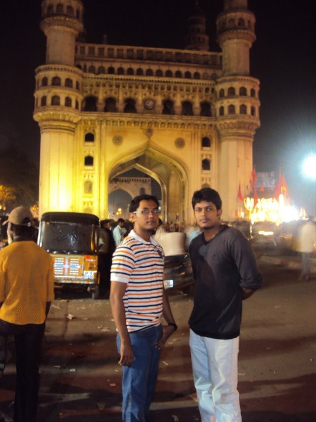
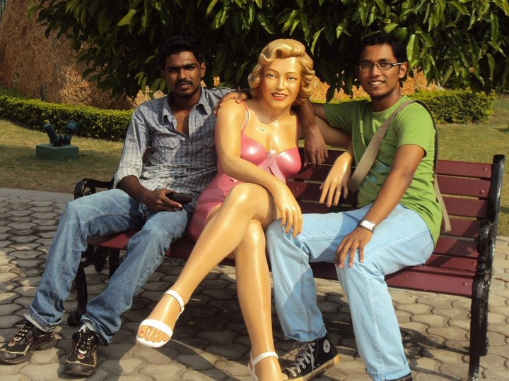
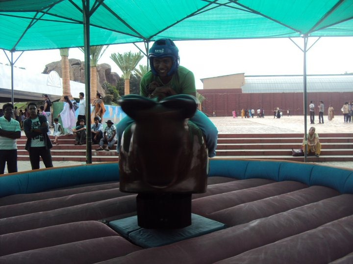

**SET RAIL TO HYDERABAD..**

**ME, SREEVIN, KEVIN**

**07/10/10**

14:00 - started from Trissur railway station. Mine as well as Kevin’s mom came to bid us 'good bye's.
<!-- more -->

Thinking about what to do next. Coz it’s a long long train journey ahead. 24 full hours in train.

15:05 - got a seat very next to the door. Means? We have a direct access to the charging socket. What more? Sreevin has brought his laptop and me, my external hdd.

17:11 - watching KAL HO NAA HO with Sreevin and Kevin. Too good a movie it is.

22:43 - movie seen, dinner (chapatti and some kind of veg curry) eaten, i think its time for bed, no berth. As a precaution against theft, I’ve to sleep with my travelling bag as a pillow. Damn its rock hard. Good night me.. All is well.

**HOME, SWEET HOME, SREEVIN’S HOME**

**08/10/10<!--more-->**

06:29 - rise and shine. Kevin’s already awake. Hmm.. Unusual. Moving on.

06:53 - further unusual stuff. Me and Kevin were photographing our 7+ mobiles put together when a hijada rounded us. Bhaagyam. Onnum poyilla.

07:00 - Enjoying nature's scenic beauty. One can enjoy this stuff only while a train journey.

The railway staff came to take orders of breakfast. We said 'no' because we had bread and jam with us.

07:10 - collateral damage. I had kept the bread in our handbag and it seems i slept over it. Damn. Now the whole thing is squished. What next?

07:32 - again hijadas. Again survived.

08:10 - Business, business. A couple of passengers sitting opposite to us displaying how business is carried out in our place. They bulk bought speghetti for women and are now changing the MRP sticker on them. The thing cost rs 140 initially. And now costs rs 200 . I assume they bought it for rs 120 . That means a direct profit of more than rs70. What an idea sirji..!

14:03 - got down at Secunderabad railway station. The situation here is totally opposite to that of in Kerala. Developed infrastructure and underdeveloped people.

14:32 - waiting for the 226 number bus which will take us to BHEL where we are going to stay throughout the tour with Sreevin's family.

14:45 - got the bus. It’s hot in here. A female bus conductor came and charged rs39 for the journey. Way cheaper than the auto journey which we considered that would cost rs 300 . Got our seats. Set the gps on our mobiles, off the bus go..!

15:11 - this bus journey is frikkin boring. It stinks in here. It’s killing me.

16:23 - reached sreevin's house. The best thing about here is his parents. Just like the old kelvinator advertisement - 'the coolest ones'. We wants to go out later. And he was trying to get a driver for us. I said we could drive. he didn’t say a word but gave the car key to me saying 'enjoy your stay'.

17:15 - had a bath. Feeling refreshed.

17:40 - more, uncle's a fabulous cook. We ate a delicious biryani supervised and made by him. Superb. Stomach is stuffed.

18:00 - took the car. Its a Daewoo matiz. smooth car, tough drive, good roads, tough traffic. What’s the panic buster? An _HTC hero and a Nokia 5800_ for the navigation and my _Nokia e63_ for fast internet access. And of course, blogging.

19:00 - still caught on the traffic. On the way to see Renish chettan, Kevin's cousin. And later to go to GVK ONE mall. Bought an in-car mobile charger, just in case mobiles need charging.

19:32 - in GVK ONE mall.. Awesome awesome sight. Huge mall... Daringly beautiful place, hot and sexy chicks all around, we 3= excited!

20:36 - saw a 4D film here. Awesome experience. Basically, it’s a 3D movie with extra effects like, ground shake, air surge, smell and water smoke.. Great.

21:47 - had _KFC Juicy Chicken, Coleslaw, and Virgin Mojito_.. All except mojito was pure crap.

22:39 - Saw Kevin’s bro and handed over the package to him. It was tough finding the place.

23:41 - reached back home after lots of wrong twists and rerouting. All thanks to Google maps. We got back safe somehow. Otherwise it could easily have become another SAROJA story.

**NEW DAY, NEW HOPES**

**9/10/10**

07:18 - rise and shine. Straight to bathroom. Brushed my teeth.

08:21 - Sreevin's naughty sister was already up and thus spend some time playing with her.

09:34 - had breakfast. Again i must acclaim that sreevin's parents make great food. It was hyderabadi poori and masala. Hmm… Delicious.

10:00 - back on road. First is the famous landmark, #hussain sagar lake.

11:10 - reached Sanjeevaiyah Park. It is situated on the outskirts of Hussain Sagar lake. One can get good recreation plus an awesome view of the lake from this site.

12:45 - the unexpected visit to the park turned out to be awesome. Took some fantastic photos. The rock garden was great.

12:54 - ate paav bhaji and samosa frm a local chaat center

13:12 - paid a hefty price of rs 214 for this local food. Feels cheated

13:41 - to prasad's theatre's for IMAX show.

13:53 - gonna see ENDIRAN @ multiplex.

17:00 - ENDIRAN was not as good as expected. Still the show was great.

17:16 - enjoyed the ride at MIRROR MAZE. Confusion confusion.

17:37 - waiting in Q for our chicken _McGrill at Mc Donalds_.

17:49 - good burger it was..!

17:55 - some people are trying out rock climbing. I too wanna climb.

18:17 - i too did. Man, it was tough, yet, It was aweeeeeeeesome. My adrenaline levels raised ti heights you cant imagine.!

18:20 - next is a laser show @ lumbini park.

18:29 - a crook policeman stopped us. Demanded rs 600 . Managed with a 200 rs.

18:39 - in Q for laser show.

19:00 - finally, after lots and lots of confusion, we got our seats in a good place for the show.

19:45 - the show was indeed colourful and musical.

20:00 - now towards Birla Mandir. Its uphill and i can see it from here itself. The lights and the marble temple looks splendid.

21:00 - over and out. The temple was clean, calm, quiet and spiritually enlightening. 

21:05 - now to Charminar, one of the most famous Landmark of Hyderabad.

22:39 - did some typical local hyderabadi shopping. And for dinner, Pani Puri. As I always say, I CAN EASILY SURVIVE ON PANI PURIS..!

23:00 - Still on the roads. This time, to City centre mall.

23:43 - All malls have closed down for the night. Now at Cafe Coffee Day for a late night coffee and Snack.

24:57 - Reached back home safe.. Hoooo.. What a day..!

**ELECTRIFYING DAY… SHOCKING, RATHER THAN ELECTRIFYING..**

**10/10/10 – SEE THE DATE. AND YOU CANT IMAGINE WHATS IN STORE FOR YOU..!**

06:46 - Woke up, brushed up,now struggling to wake others up.

06:50 - The electricity had gone at 2am last night, so most of our gadgets are not fully charged including this one.

We have lots of travelling to do today. Lots of places to see. Hope, electricity will show up soon.

07:28 - havoo. power came. Time to get our gadgets charged.

08:51 - had breakfast. Idli and sambhar. Feeling excited coz a long and eventful day awaits us,

09:29 - Get, Set, Goooo..!

10:36 - reached Snow World. We got a combo ticket for 3 rides namely, Snow World, RainForest and Death Valley.

12:35 - I am too tired to write anything.

Two Reasons:

1- The Snow World was awesome. Photos would be self explanatory. The other two rides were full of crap.

2- Received Shocking news. I got secret Information that; my mom secretly checked my emails got all information regarding my love, with photos and other evidence. Damn. I'm screwed.

12:49 - now searching roads to Ramoji Film City.

15:39 - Finally, reached here. I'm exhausted of all my moods. The entry fee here is rs 400 per head.

17:45 - Out of Ramoji Film City. Man it’s huge. But Frankly, I didn’t enjoy it well, because of the above two reasons.

18:00 - we are all sad and exhausted. We need some alcohol, especially me.

18:16 - Searching for a pub with good disco and of course, alcohol.

20:00 - the search ends here. We went to some of the best disco pubs in the city. What's bad? All need a couple entries.

20:18 - bought four bottles of _Bacardi Breezer_ and two large bottles of Strong Tuborg beer, one of the best beers.

20:29 - caught in a railway cross. Two beers still incomplete.

23:00 - off to bed, after witnessing some freakily funny actions of a drunk Kevin Shimo. Really, Laughed My Ass Off.

Adios for the day.

**LAST DAY**

**11/10/10**

I'm afraid, todays entries are not time bound. Cuz today was not much eventful.

Today we woke up late, everything was slow. Saw commonwealth Games for some time, had breakfast, played for a while with Shreya (Sreevin's sister) and went out for the so called shopping with Shreya.

Uncle suggested that there's a great place for shopping in a place called Malaysian Towers. It took us 1 and half hours of wrong twists and turns to find the place. Actually, the thing was called D Mart in an area named Malaysia Township. The freakish thing is that, it’s just a super market, a miniature form of Big Bazaar. Damn. There everything ended. We bought some food stuffs to eat while on the train journey back. And went back home.

We had promised uncle that we'd all go out together for lunch.

Lunch spot was selected by us, _Hyderabad House_, well known for the biryani. Food was exceptionally superb. Then after, we went to a sweet house to buy sweets to home. This time also, uncle paid ignoring our protests. What a generous man..!

So, everything was over, we went back home, packed our bags full and bid everyone adieu. Took a local train to secunderabad.

We will board our main train from secunderabad to tirupathi at 18:05 (god knows, its **Indian Railways**)

And from there, we'll find some way to reach Kerala.

Why this uncertainty?

Because, its Dussera and transportation means are all booked. So whatever medium is available, we are bound to take it because, we need to reach our homes as soon as possible.

**NOT OVER: One more day**

**12/10/10**

07:50 - Now I'm sitting at Tirupathi Railway Station. The funny thing is, there is NO bus or train that would take us to Kerala (or even Coimbatore) until evening. So we're going to rent a room in Railway Station and spend the day here till the train that would arrive at 21:10.

08:00 - yesterday's train journey was fun. Our local train from BHEL to Secunderabad was late by 40 minutes, by the time it reached Secunderabad, our train to Tirupathi was already moving. We had to run across 4 platforms to reach it along with our OVER-Heavy bags.

09:00 - took a room near railway station. Rs 300 only all minimalistic facilities available.

10:00 - Kevin bought 5 bottles of _Bacardi Breezer_, again cranberry, my favourite flavour. Drank one.

12:39 - watched IND-AUS cricket match, played prince of Persia in Sreevin's Laptop.

14:00 - @tirupati bus stand to search for a bus to Coimbatore,(then to Trissur) looks as if a train journey is better.

14:18 - Kevin and Sreevin are interested in seeing an Adult Movie, since they saw an interesting poster nearby. And me? - I'm always interested. But the thing is, the theatre's name's written in Telugu. So we are using GPS on our mobiles to find out the nearest theatres and their location.

14:28 - found the theatre, got the tickets, now inside, hoping for some real fun.

17:34 - Damn. It was horror, literally. Yes, it’s an old English horror movie with zero nude scenes. Just the usual waddy stuff ancient horror movies show. What more? - its re-dubbed into Telugu. Fantastic!

19:21 - back in our room playing POP again.

20:39 - vacated the room, bought some more _Bacardi Breezer_ for those at Kevin's house. Yeah, they drink..!

21:00 - in railway station for the last phase of the return journey. The train might arrive within 20 minutes. It’s a local compartment. So, rush would be there. Moreover, its Tirupati, so many pilgrims are there too, most of them, Tamilians. I've always wondered about these people, they are spiritual-up-to-the-zenith. But, whatever it is, they won’t take a bath, nor brush their teeth, for a change. I wonder if there is any superstition among them that say that, personal hygiene diminishes spiritual enlightening. Uff.

**AYOO, THIS SHIT IS NOT OVER YET..!**

**13/10/10**

02: 26 - uff uff ufffff. Having to stand (no, i'm literally in air) in a local compartment of the jam-packed-train from Tirupati to Thrissur. I'm been standing like this for more than 3 hours now. God knows, maybe I've to stand like this for 12 hours at a stretch. #incredibleindia #lifetimeexperience

I can’t even breathe properly. I've been standing on one toe all this time, coz if I’ve to place the other toe down, that has to be on somebody else’s body. Coz there are hundreds of women and children lying down fast asleep in our compartment and like a 200 extra including me, standing. Can’t complain. This is India, where freedom comes down to every individual.

08:16 - reached Trissur. Happy to see my hometown and hear my home language. #eyecandy #earcandy

I’m praying to God, not to give me any more adventures on the bus back home. If there happens one, I’ll sure write.

On the other case, adios amigos..!

PS: REACHED HOME WITHOUT UNDERGOING ANY MORE FREAKING ADVENTURES.
