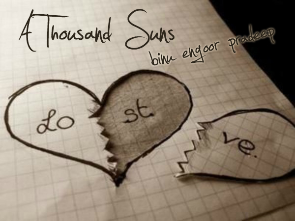

# A Thousand Suns

A story of lost love, lost hope, lost happiness and lost life.

_“What if I can desert this body and dissolve with the wind. Flow along with it absorbing all that the world carries with it: all the love, the commotions, the chaos, the hatred, the care, everything. Can it make me feel complete ever again?”_
<!-- more -->
I was thinking as the evening breeze blew fiercely on my face.

The sunken eyes behind the horn rimmed spectacles had a story to tell. A story of lost love, lost hope, lost happiness and lost life.

# Lost life

She was tired as usual. The first thing I saw her do today was throwing up in the kitchen sink. I ran up to her to rub her back. I saw blood in the sink. I wasn’t amazed. All I wanted to do was to console her. But as usual I fell short of words to say.

She cleaned up and turned to face me. Her eyes still had the glow of a thousand suns which made me fall for her at the very first sight.

She raised her fragile hands and held them up against my lips as if she wanted me to be silent as she spoke. She came close to me and whispered in my ears.

_“I’m almost..”_ Her voice broke.

Those words ringed a thousand times in my ears. It was playing in repeat as I was walking down the street, when I was at my work-desk, and even now, sitting in the bus heading back home. Those simple subtle words are still haunting me like a ghost.

I hope I can see her smiling face when I get home tonight.

_“I like this wind. It gives me hope. I reassure myself that my love will keep her alive. There is a huge power in our love and this wind carries it”_ I thought aloud. My fellow passenger looked quizzically at me, shrugged his shoulders, got up and left in haste.

# _Lost Hope_

_“I’m sorry, there’s not much time left. Now that she knows, you need to give her maximum care and support and keep her happy till it lasts”,_ the doctor was telling me.

How can people be so cold? I know he’s a doctor and it’s in his profession to talk the truth and sense. But he is also supposed to give me hope. Why is he not doing so?

Everything that mattered to me is lying down 2 walls away from me breathing hope in each and every second. How can I tell her that it’s all over? How can I tell her that there’s no hope?

I wish I had wings so that I can pick her up and fly straight to heaven. But the doctor’s cold words froze my wings and threw me into a giant black hole.

My world was collapsing on me. I knew I was done.

# Lost Happiness

She was unusually sick, I didn’t know why. I thought it was because of the shock from the happenings. Things were too hard for her to bear.

She understood what I was thinking. _“It’s not just that. I think there’s some serious disease growing inside me. That’s making me sick.”_

_“Shut Up!”_ I said. _“It’s not a disease, its fate. You know what the gynecologist told us. Everyone is not blessed with it. Some can, some can’t. We can but just wish for it. It is in the hands of God. Don’t blame yourself for everything”_

She sobbed. I hugged her. I held my world in my arms. I closed my eyes.

Suddenly something was different. My white office shirt was getting wet.

_“Tears! I’ve grown familiar with this wetness”,_ I thought.

I looked down at my darling, she was shivering and my shirt had turned bloody red. Blood!

# Dreams

She drew open the white curtains. Golden light filled the room. I was still in bed, fast asleep, tired from all the fun in the previous evening. Yesterday was our first wedding anniversary. I did everything I could to make my princess happy. She was literally in heaven. She was beaming with joy and love. Her eyes always had the glow of a thousand shining suns. Now they shone even better. I stayed awake late that night watching her sleep like a baby, in my arms.

_“This is life.”_ I’d thought.

_“Hey mister! It’s 8 O’clock already! We have other plans for the day”_ She shook me.

I growled. _“Let me sleep for a little longer.”_

“Listen, I’ve something very important to speak to you about” She never before sounded this serious. I opened my eyes. The sunlight was blinding me. The diamond necklace I gifted her the previous night still twinkled in her velvety neck.

“What is it?” I tilted my head to her side. She rolled me over and sat on top of me, and started playing with my chest hair.

I looked at her. She was very beautiful. The sunlight blessed me by lighting her hair with its golden glow. Dressed in my NY T-shirt and a puma shorts, I thought, a modern day angel must be looking exactly like her!

I caressed her forehead and lifted myself up and kissed her.

“I see you’ve changed a lot” She said.

“_What?”_ I was confused.

_“Finally you got matured. I doubted whether I had the role of your mother or your wife. But luckily I have a husband now!”_ and she chuckled.

Thank God. I thought she was heading for some problems.

_“I have a wish”_ She said.

_“What?”_

_“I want a baby”_

_“WHAT??”_

_“I want to become a mom”_

_“FOR REAL??”_

_“Yes!”_

_“I love you, baby”_

_“I love you, sweetheart!”_

Love. Happiness. Attachment. Hope.

# _Life_

_“Hey Heyy..!! Look who are coming.”_ My friend was exclaiming as the college bus approached packed with first year students.

One by one, they stepped out of the bus. We were scanning every single girl with our X-Ray eyes, giving them rating from head to toe.

Then something happened. A white Nike sports shoe greeted me. I looked up, my ratings going higher as I looked higher; finally I saw that face for the first time in my life.

I said _“Wow!”._ A pair of eyes which had the glow of a thousand suns adorned that face. She was miss sunshine. My heart leaped a world record beating jump as I saw her smile.

I didn’t have to think twice. I knew at once. It was the face that I saw in my random dreams. This was the girl  I was waiting for. I found the meaning of my life. She’s mine!

Love had hit me, hit me hard and swept me off my foot..!

## God Why??

You did give me everything: But in reverse order.

Please take back the reel of my life and play it from back to first.

I won’t mind the sadness in the beginning, but I can dwell in her smile forever..!

_“I want to get dissolved with the wind and flow along. Will it make me complete as she used to make me feel?”_

# EPILOGUE

I still remember that day. The day which brought an end to my world. Her motionless face and dry, grey eyes greeted one black morning. There was no glow in her eyes. The thousand suns had decided to set together. And I knew, it was all over.

Author's Note: The following is a work of _fiction_. Any resemblance to persons living or dead is _purely_ coincidental.