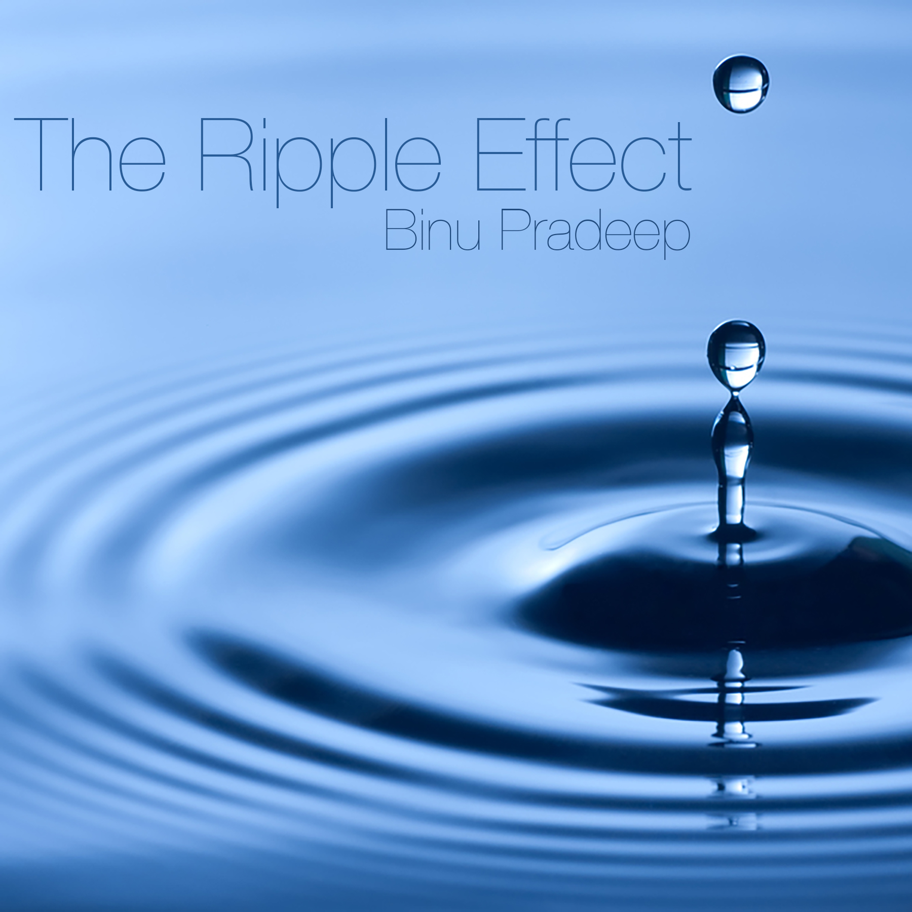

 
A word or an action from your past can trigger a chain of events that will define the course of your life many years later.
<!-- more -->

* * *

We've become ghosts of our past. This is not the kind of life we had imagined. Like the ripple effect, a word or an action from our past triggered a chain of events that led to this moment. But, I don’t know what and when. I don’t know what I will do without him. But, I know he is unhappy. So am I. We have grown up together to be two people who no longer knows each other. I wish I could go back and do something that would cause a change in the way things turned out in our lives.

* * *

## Love

###  Her

"One, two, three… Four!" I have four single rupee coins with me. That would give me four minutes to talk to him. I have to walk faster to the payphone. He is expecting my call. I want to talk to him. His enthusiasm, the things he says, his jokes, his view of life, I want to ask him so many things. His voice and speech are like nectar, and I want to sip every drop of it. He is the love of my life!

### Him

"One, two, three, I'm tired" I'm not going to try calling her again. I know it’s her birthday. But, if she doesn’t want to speak with me, I shouldn’t keep trying. I think this sudden conference was her way to avoid facing me on her birthday. My surprises don't make her happy and excited anymore. Our children grew up and moved to far away places. Now, all that I have is she. She lives with me in person, but where does her spirit reside? How can I find it?

* * *

## Happiness

### Him

"This world is so beautiful. We can do so much with our lives together. Let us fly high like these kites in the sky. See that blue one, that is me. And that red kite is you. Look! We are flying towards each other" We lay there in the rooftop of my apartment looking at kids flying kites at a distance. I was humming tunes in her ears while she played with the curls of my hair. The little things in life that give you immeasurable happiness.

### Her

"Hey, did you see the wooden storage box that was there in the attic?" I asked him as he was walking by the kitchen. These days we hardly looked at each other's eyes when we spoke. We still live together, share a room, but just ignore each other's presence all the time. We could go on for days without really speak a word to one another.

"You mean the one that had some old cards, toys, and stuff? yea, I tossed them into the garbage last week when I was cleaning the attic. I wanted to use the box to store the tools in the garage." he said.

"They were all the gifts, and cards we exchanged when we were younger. Didn’t you remember?" I just got a blank stare as a reply.

He said, "I guess, memories are mere pseudo-realities. They take you to a place where you want to exist, only to realize moments later that you are not that person anymore.  I would rather have that box used for something more productive than to store the things that do not represent us".

There is no point in arguing. We have been doing that for so many years now. I guess he's right. I shouldn't keep looking back to my memories to find happiness.

* * *

## Hope

### Him

"Who could be the luckiest person in the world?" She keeps asking me these questions that put a smile on my face. Maybe she's trying to find out what my perspective is.

I said, "I believe that the luckiest person is the one who meets his true muse when he is younger and gets to grow up with her. Like us! You are more than a girlfriend to me. You inspire me and encourage me to be a better man. You enlighten the artist in me. And more than everything, I love the way you sleep, curled up, resting your face on my arm. And I would do anything to wake up to you every day for the rest of my life!" She looked at me with glowing eyes.

Kisses. Short moments that unite two minds and bodies.

### Her

I still remember the days when we started seeing each other. Every time he walks up to me or calls me, my heartbeat increases, I sweat a little and I become speechless for a moment. Then when we get going, the tension is released and I am at ease. Even today, after all these years of marriage, when he walks up to me, my heart still races, my forehead still perspires a little, but then, when we look at each other, something is missing. We lost that spark. We misinterpret each other's words. We stopped sharing what is going on in our lives. I always have a feeling that something bad is about to happen to us even when he is being really nice to me. Where did that rapport go: that amazing accord that we always enjoyed?

* * *

## Trust

### Her

"How much longer?" I asked him. I love these constant adventures with him. We share a beautiful camaraderie when it comes to choosing the things to buy or places to visit, food to eat or activities to do. This time we were hiking up a hill close to the city.

"Not much, we are almost there. You see that ridge ahead of us? I was told that the view is right after we cross it." We kept walking until we reached the ridge.

"Now, close your eyes." He said.

"What do you mean, close your eyes? There is a goddamn cliff in front of us which we are about to cross, and you want me to close my eyes? For what?" Although I tried to sound angry, he knew that I am already loving the feeling of venturing into something I haven't experienced.

"Just do it. Close your eyes, hold my hands. Don't open it until I tell you and keep walking beside me."

"But the ridge is so narrow, we might fall," I said.

"If we fall, we fall together. Do you trust me?"

"I do"

"Then let's go!"

I closed my eyes and held onto his hands. The wind was blowing fiercely against us. I could feel the chill; a storm is coming. This is too risky. We could die doing things like this. But I trust him more than I trust myself. If there is anything I can give back to him for the love he is giving me, I would do it, even if it involves jumping off a cliff. My body was trembling because of the wind as we crossed the narrow pathway. But, I knew I were in safe hands.

"You may open your eyes now." He said.

I opened my eyes and there in front of me was a big beautiful double rainbow over the villages. It looked as if the iridescent colors were flowing from the heavens to walls of these tiny but colorful village houses. It was magical. Every time I am around him, something like this happens which makes me wonder, is this all real? Or, am I dreaming?

"Did you know that we would see a rainbow when we reach up here?" I asked.

"No, I guess that was pure luck," he chuckled. Something about his laugh told me that he knew what he was doing. The scene and the glorious misty wind were a feast for my senses. I closed my eyes again to thank God for presenting us these beautiful moments. When I opened my eyes, he was on his knees. He had a ring in his hands.

"The love of my life, the queen of my dreams, will you be my wife?"

His voice vibrated my entire whole. My heart started beating so fast, I thought I might die. This was everything I have been wishing for.

I said, "Yes! In this and all of my lives!"

We stood there in each other's arms watching the sunset. That day's sun had a glow of a thousand suns. It was setting only to mark the beginning of a beautiful journey.

### Him

I am looking back to the day I proposed her. She was so happy and beautiful. I made her walk along the ridge of a steep hill with her eyes closed only to prove to her that I am dependable. Youthful stupidity. But retrospectively, I feel that those were the moments that defined the course of our relationship. We trusted each other so much. She was very comfortable in my arms. But over the years, things have changed. This marriage seems to have become a cage for her freedom, or so she says. I have given her the liberty to choose her own career, social circles, preferences etc. But, the only thing I asked from her in return was to set her priorities straight. Even with our growing differences, she raised our children well, she had been a good social being, and I respect her for that.

In the beginning, she wanted me to help her with everything, school stuff, work stuff, and household stuff. I used to tease her saying that she doesn't know how to do anything. I now realize that she was perhaps asking me to help her so that she can be with me always.

But at some point, I put a thought in her head that the more I help her understand things, the more resistance is there for her growth. That thought grew up inside her like ripples in a pool. Now my very presence around her makes her agitated. She does not want to let me know about the things in her life.

When we first met, we felt as if we had known each other for a long time. And now, after all these years of living together, she feels every bit like a stranger to me. I was told that a relationship is all about the hope, faith, and trust it generates. I don’t know whether we have much left in that regard.

* * *

## Life

### Him

She held on to my hands ever so tightly, never letting go. She said, "I know you have invested so much thought, time, money, and energy on your education abroad. But are you sure you want to go? I will be lonely without you."

"I'm leaving you today only to come back quickly and set a better life for ourselves," I said. No words of mine could convince her. She just held on to me until my flight's first boarding call was made. We parted ways silently. But, I knew I was coming back for her, soon.

### Her

5:00AM. Alarm ringing. He is sleeping.  Today is the day I will not hit the snooze button. I woke up silently, walked to the basement, I had already packed my luggage. It is hard to leave him without letting him know. But, life has been unfair to us. Today, I must leave him. He will be sad, devastated, depressed. But I think he will understand. I stepped out into the rest of my life. Without him.

* * *

## Epilogue

We've become ghosts of our past. I thought I had figured out everything. My teenage self used to tell myself that my last breath would leave my body before she would even think of leaving me. But I was so wrong. I wonder what happened. Time changed us a lot. What is love? For me, it means her.

We have grown up together to be two people who no longer knows each other. I wish I could go back and do something that would cause a change in the way things turned out in our lives. To reverse the ripples, that shook our life.

The doorbell rang.

Could it be her?

 

 

* * *
