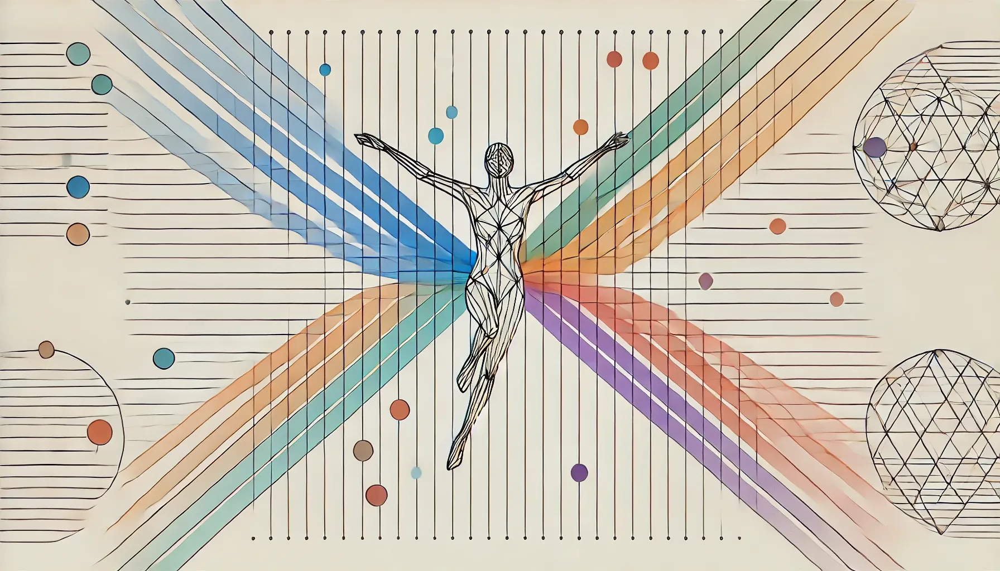

{ loading=lazy width="800" }
<!-- more -->
*Inspired by this [Reddit post](https://www.reddit.com/r/selfimprovement/comments/1hobqog/i_hit_a_major_turning_point_in_life_here_are_10/)*

## Your comfort zone is your prison. The longer you stay, the smaller it gets.
Stepping into unfamiliar territory feels unsettling, but staying indefinitely within your comfort zone gradually diminishes your potential. Growth happens by taking small, deliberate steps that expand your capabilities. Your comfort zone contains your strengths, but should be used as a foundation to build from, not a limitation.

## Most people don't care about your success – they just don't want you to outgrow them. Move in silence.
Humans evolved in small tribes where survival depended on status within close-knit groups. We instinctively compare ourselves to those we interact with most frequently, often feeling threatened by their success while remaining indifferent to distant strangers. This tribal mindset explains why we focus on competing within our immediate circle but feel no rivalry with millions outside it.

## Resting isn't laziness – but avoiding hard work is. Learn the difference.
True rest leads to renewal and prepares you for future challenges. The distinction lies in intention - are you recovering to return stronger, or avoiding growth entirely? Recovery is strategic, while avoidance stems from fear.

## Your mental health thrives on action. The more you sit and overthink, the worse it gets.
Action interrupts rumination. Start with the smallest possible step to bypass overthinking. The question "What's the smallest step I can take now?" has transformed many lives by breaking the paralysis of perfectionism.

## Small habits run your life. Build good ones or bad ones will build themselves.
Progress happens through small, consistent actions rather than dramatic changes. Every small win builds the foundation for larger transformations, and consistency matters more than intensity.

## If you avoid discomfort now, you'll pay for it tenfold later. Do the hard things first.
Facing fears head-on helps rewire the brain's response to challenges. Courage means acting despite fear, not waiting for fearlessness. Growth comes from engaging with discomfort rather than avoiding it.

## No response is a response. Silence speaks louder than arguments.
Sometimes the most powerful statement is no statement at all. This isn't about being passive - it's about choosing your battles and knowing when engagement serves no purpose.

## The best investment you'll ever make is in learning to control your emotions. Master that, and you master your life.
True emotional mastery isn't suppression—it's feeling emotions fully while managing them effectively. The RULER method (Recognize, Understand, Label, Express, and Regulate) provides a practical framework for emotional intelligence.

## Everything compounds – debt, wealth, habits, or laziness. Choose what grows.
Your everyday decisions generate momentum. Whether it's building savings or developing skills, small choices stack up over time. Be intentional about what you allow to compound in your life.

## Your future self is watching. Show up for them every day.
Time passes regardless of action or inaction. Every moment spent overthinking is borrowed from your future self. Taking action, even imperfectly, serves your future better than waiting for perfect conditions.

> "Hard choices, easy life. Easy choices, hard life." – Jerzy Gregorek

Remember: The path you choose today shapes the life you'll live tomorrow.