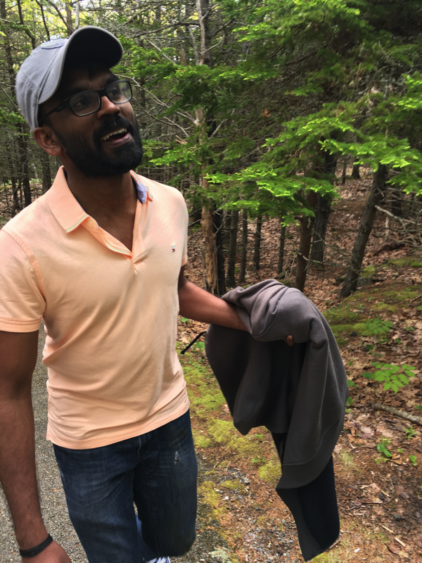

## Preface:

This is a long-overdue travelogue post. This is a sequel to the post titled "THE ONE WITH THE HOBO, THE TREE MAN, THE HUNGRY HOG, MR. VERTIGO AND THE HEADMASTER" which I published on WordPress in early 2017. I thought I lost my draft notes from the trip, but recently found it when I was looking through one of my notes applications. Posting it verbatim.
<!-- more -->
* _Date:    May 26, 2017 at 5:41:16 PM EDT_
* _Weather:    55°F Mostly Cloudy_
* _Location:    I-295 N, Freeport, ME, United States_

Another last moment trip. We decided to go to Acadia just yesterday. And of course, we didn't have much time to plan anything. That being said, me being myself, I have a general gist of what to do and where to go. We’ll see how it will span out over the upcoming three days.

* _Date:    May 26, 2017 at 5:51:40 PM EDT_

## Day 0: Planning is too mainstream

### Topography:

This trip consists of a terrain full of Vivid Greens, Rugged Mountains and the Cool Blues of the lakes and beaches.

Acadia National Park is located in the North-Eastern corner of the USA.

Fun fact: Acadia sunrise is so famous as it is where the first sunrays of the morning falls on mainland USA.

More on Acadia later.

### The Crew:

Introducing the other Shambhu, Sarath Krishna. Sarath was missing on Tour de West because he was on vacation in India. The hallmark specialty of Sarath is his repeat mode. You can always see him sitting in a corner watching or reading something with a corona beer right next to him. I often admire the focus he has on what he is doing at that moment. But don’t expect him to hear anything you are talking about while he is busy at something. The dude just cannot multitask. So, if you want him to listen, make him stop whatever he is doing. That way you can be SURE that he is listening (and he will be). Because of this quality, PG calls him Repeat-esh!

In this journey, he gets the name Mr. No-Wallet: you will soon find out why!

If you've read the tourr-de-west blog \[[link](https://mybluejeans.wordpress.com/2017/05/22/the-one-with-the-hobo-the-tree-man-the-hungry-hog-mr-vertigo-and-the-headmaster/ "THE ONE WITH THE HOBO, THE TREE MAN, THE HUNGRY HOG, MR. VERTIGO AND THE HEADMASTER")\], you're already too familiar with Nikhil Krishnan. And he is still known as HOBO as he is reluctant to let go of his beloved “homeless boy” jacket. But we still call him Shambhu Annan.

Then there is me. Still, colloquially called the headmaster. Might end up getting called yet again as Nataraja (I have some zesty hikes planned for this journey) We'll see :)

* _Date:    May 26, 2017 at 6:19:15 PM EDT_
* _Weather:    70°F Cloudy_
* _Location:    New Jersey Turnpike S, Lawnside, NJ, United States_

### Least Planned National Park trip

Like I mentioned earlier, unlike most of my travel in the recent past(I am a total OCD when it comes to tour planning), this trip is entirely unplanned. At around 8 PM yesterday, we finally decided that we were indeed going on this trip for the long weekend. I was too tired after a hectic day at work. Hence I decided to take a power nap of 20 minutes after which I will work on creating a tour plan outline. We have to start driving tomorrow right after work, so I have to do all the planning tonight.

The next thing I remember was my 5 AM alarm ringing. I sluggishly crawled out of bed at 6 AM. No yoga or meditation today. I watched some Acadia videos on YouTube just to get an idea of what to expect while we are there.

Stumbled upon an excellent blog that explains a few hikes and attractions in the area. (which was of a monumental help in this trip planning)

I got ready, left for the office.

Did the usual office stuff. Came back home by 4:30 PM.

Got a haircut.

Packed.

And we started driving.

* _Date:    May 26, 2017 at 7:57:01 PM EDT_
* _Weather:    72°F Mostly Cloudy_
* _Location:    1260 E Woodland Ave, Springfield, PA, United States_

### At BJ's picking up water, trail mix and other supplies

Picked up a case of spring water, a container of Vitamin Water, cake, muffins, banana, chocolate, and some savory snacks. A wholesale club/supermarket carries everything in large packs/quantities. So, you always end up getting more stuff than you need. But it is what it is.

And as always, we are behind schedule.

* _Date:    May 26, 2017 at 9:15:44 PM EDT_
* _Weather:    70°F Cloudy_
* _Location:    New Jersey Turnpike S, Cherry Hill, NJ, United States_

### Missed exit and further behind the schedule

Sarath(let's just blame Apple Maps) just missed an exit on the highway, which cost us 16 extra miles on the trip. It might not sound like much, but it adds another 20-30 minutes to the drive. If we keep driving nonstop(unrealistic since the drive is at least 10 hours long), we'll reach Acadia by 7:15 AM tomorrow. We have to stop for an overnight stay somewhere. I am hoping close to Boston.

If we can drive as far as Boston and stay at a Motel, then we can probably start by 7 AM tomorrow from Boston to reach Acadia by noon.

Tight schedules ahead.

* _Date:    May 26, 2017, at 10:36:42 PM EDT_
* _Weather:    68°F Cloudy_
* _Location:    New Jersey Turnpike N, Lyndhurst, NJ, United States_

### Passing by NYC

We are swiftly passing by Manhattan on i95. The city of lights, the city that never sleeps, is shining bright. I don't know what, but there is something about this city which makes me want to visit again and again. Sidenote: I used to live and work in NYC for a short time. New York is like home to me. The busy streets, fast-paced life and the general chaos and disorder in everything might be a huge turn-off for most people, not for me.

> To me, it feels like life: upbeat, constantly changing, complicated.

* _Date:    May 27, 2017 at 8:02:10 AM EDT_
* _Weather:    52°F Cloudy_
* _Location:    I-495 N, Littleton, MA, United States_

## Day 1: Dramatic Night, Calm Morning

Surprises are often pleasant, but sometimes we wish they never happened.

The overall drive from Secane, PA (where we stay) to Acadia National Park is 600 miles.

Sarath drove the first leg of the drive until we reached New York where we stopped for Dinner. We had burgers from Burger King, I admired NYC skyline for a few minutes, and I took over the wheels. We drove for an hour more until we realized that the car was almost out of fuel. We stopped at the next fuel exit and topped up the gas. Meanwhile, Sarath went to the store to buy stuff like napkins and such. From there we drove non-stop for another 2 hours until it was 2:30 AM, and we decided to call it a day(night?).

We got a room at the Quality Inn Motel in Marlborough, MA. While we were moving our bags to the room, Sarath noticed that his wallet is missing. Nikhil and I were sure that it should be in the car itself since he last used it at the gas station and we did not stop anywhere else after that. We told Sarath that we'd find it in the morning since its already too late and the car was packed with stuff. Something about it made Sarath a little uneasy and he picked up his phone to just check his bank and credit card apps, and there it was!

Three transactions in the past 30 minutes totaling more than $1000! He did lose his wallet. The next couple of hours was spent dealing with the credit card companies and having them reverse these unauthorized transactions and canceling the cards. The wallet also had his temporary driver's license which he renewed just yesterday(Sarath being Sarath). And Sarath is not too sure what else was in there. It would have his health insurance card, which is not much of a big deal. And I guess he had some other membership cards and some cash in change.

We believe Sarath was pickpocketed. There was this guy at the gas station store, who came in while Sarath was getting his stuff and soon the guy left without buying anything. It was around 11:30 PM and all these transactions started showing up after 30 minutes.  We might probably be able to catch the guy if we ask the gas station people to release their CCTV footage. But that will need police intervention. And it is in New York: Too much of a hassle, never going to happen. Since the credit card companies canceled the cards and reversed all the charges, we didn't have much to worry about. We decided just to forget about the whole fiasco and move on with the trip.

Sarath thus becomes Mr. No-Wallet!

The next morning, we woke up at 6 AM, freshened up. Quality Inn had a quality complimentary breakfast menu. We had some toast, sausages and scrambled eggs. Packed our bags, checked out and started driving. Beautiful weather out there.

* _Date:    May 27, 2017 at 1:02:57 PM EDT_
* _Location:    44.5281° N, 68.4026° W_

### Lunch

Reached Maine, roughly 20 miles from Acadia Visitors Center.

Stopped for lunch at a small shack named Taste Jamaica Takeout which is run by two guys who speak nothing but Jamaican. They were watching the FA Cup Final Round Soccer match between Arsenal and Chelsea (in which Arsenal won- I can almost hear PG saying yay! in the background)

The two guys were preparing food and shouting and arguing in Jamaican about the ref's offside decision. One guy was supporting Arsenal and the other guy, Chelsea. The other customers and we had no idea what was going on!

Anyway,

I got the curry goat,

Sarath got Jerk Pork

Shambhu Annan got Jerk Chicken, cuz you know, Sanghi!

Shambhu Annan went inside to get the food and grabbed all bags sitting at the counter not realizing it included orders for other people too. The owner was like “Hey man! What are you doing?” which made Shambu jump and quickly put the bags back :)

They had some picnic benches outside the restaurant where we could sit and eat the food. It was mind-numbing cold, and we were all shivering. However, the food was decent, and we had our jackets on. We survived.

* _Date:    May 27, 2017 at 6:11:06 PM EDT_
* _Weather:    54°F Cloudy_
* _Location:    Great Head Trl, Bar Harbor, ME, United States_

### After lunch

After having lunch at the Jamaican Place, we headed out to the Visiter’s Center of Acadia National Park to pay for the park pass and get some goodies like maps and such.

Acadia National Park has a 17-mile one-way loop road conveniently named "Park Loop Road."

This road is usually open to general traffic after peak winter. All of the places I planned to visit in Acadia are along this road. Today morning I opened google maps and set the directions for Beehive trail which is along the loop road. But the maps told me that no route was available. When I looked closer, it said that the park loop road is closed from Apr to Dec. New Challenges!

I checked the NPS(National Park Service) website, it doesn’t say anything about road closures. If the road is closed, then that means we would have to avail the Park shuttle that runs throughout the park to move from one place to another.  This would be an issue as we will then have to plan things and carry with us all the food, water, and other stuff for the day. Since the main idea of this Maine trip is to do some marvelous hikes, increasing the load that we have to carry will adversely affect our ability to hike long distances.

We stopped at a gas station for a restroom break and to grab some beer. I had a casual conversation with the attendant who told me that the park loop road should be open now since it always remains open after the closure in winter. She also added that she had been at Acadia a couple of weeks ago and hiked the Great Heads trail and she thought it was awesome! (Which is great since I have Great Heads trail on my itinerary)

Once we reached the Visiter’s Center, we got confirmation that the park loop road was open. Great!

We bought the park pass, and I handed it over to Sarath to keep. We went to the restroom and walked back to the car.

That's when Sarath told me that he does not have the park pass tag with him. Dude! Yesterday it was the wallet, now this!

We went back to the Visitors Center hoping to find it. Luckily he found it lying near the restroom. Good.

It was pretty cold outside. It was interesting to see a large number of Indian tourists there since we are usually very conservative about traveling in extreme weather or doing adventurous stuff in general.

We started the car and drove to the Sand Beach along the Park Loop Road. On the way, we stopped at a couple of overlooks and admired the view of the ocean and the several small islands of Acadia. From afar these islands look like little pebbles in a pond. Acadia is a gorgeous national park

When we finally arrived at Sand Beach, we realized that we were a bit too late to reach there. The parking lots were full, and there were cars parked on the sides of the road also. The road leading to the Sand Beach was a one-way drive. We didn’t want to leave the parking lots to find parking because if we can't find parking close by, we can't just come back to the lot since the road is one-way. We waited for a while to see if anyone was going to come and get their cars. After 15 minutes of driving inside that little parking lot, we realized that there was another parking stretch right outside that parking lot and we managed to find a spot quickly. We packed the essentials(water and snacks) quickly and set out for the famous Beehive Trail.

### Beehive Trail

Already there is hearsay among my friends here in Philadelphia that I  make people walk a lot, which is not something I deny. But you should see through the hubris and realize that hiking/walking in nature is such an awakening experience.

I could feel that the Shambhus weren't particularly enthusiastic about the hiking part of the trip. And they told me that they would rather spend the time at the beach or bar-hopping rather than do any hiking. So, to accommodate their preferences, I just kept two must-do hikes(one for day 1 and another for day 2) in the plan. The rest was all about driving around, sightseeing, and food. But honestly, you go to Acadia for hiking. That is the only real way to experience the beauty of the park. You get to see all the different views, terrains and natural scenic beauty only by hiking the incredible trails of the park. To each, their own I guess. I digress.

Both the Shambhus was taunting me saying that I was going to make them walk a lot today and it will be slow and tedious. Beehive trail, however, is not the everyday-hike. I am glad I didn't disclose much about the trail to them. That way, every bit of this hiking experience will come across as a surprise. Moreover, I can adjust the rest of the tour plan based on how well they like this hike.

Beehive trail soon showed its might. What seemed like a  leisurely walk in woods soon became that of hopping small rocks and then bigger boulders. Pretty soon we were rock-scrambling and then holding-on-to-dear-life on one of the iron bars attached to the rocks.

We came across a few trail markers. Trail Markers, as the name suggests are markings that help you make sure that you are staying on the designated trails. Across the US, I have seen two main types of trail markers.

1. Cairns, which are rocks stacked on top of each other
2. Paint/Reflectors/ Flags of a specific color.

In places where multiple trails are intersecting, each of the paths usually gets a designated color. Many Pennsylvania parks typically name the trail by the color of markers (yellow trail, white trail, blue trail, etc.)

It looked like Acadia have all the trails marked using a combination of blue paint and Cairns.

Within minutes we were up on the mountainside, walking on one foot wide ledges carved around the mountain with nothing but some random iron bars to hold on to. Many places were completely exposed to the cliffside.  Beehive Trail is not for people with the fear of heights. Not suitable for kids. Very practical hiking experience with no room for goofing around. It was undoubtedly adrenaline rising experience.

The rock scrambling went on for another 15 minutes. The group in front of us were having a tough time as a couple of them had a fear of heights. I had other concerns that were slightly worrying. Shambhu Annan’s wedding is in a couple of months. He had a leg injury a year ago. I didn’t want this trip to stress him out to the point that his leg pain comes back. And Sarath has not hiked or walked long distances in the near past. Therefore I had to frequently make sure that they were both okay. It seems like they were having a blast! And that put me at ease.

When we venture into something new/hard/adventurous/demanding and find success doing such activities, it gives us a massive emotional boost. And that "high" will motivate us to do more things or take more risks. I have seen this repeatedly in school and college where my friends who have massive stage fright, when forced to do something on the stage, struggles at first, but once they find their rhythm, becomes unstoppable and they want to continue to be on the stage performing. The same is the case with outdoor/physical activities. Once you break the fright, then you're on your way to having an excellent time.

This is an incredible little hike with thrilling rock scrambling and stunning views. Those who control their fear of heights are rewarded with incredible views of Sand Beach, Great Head, and the surrounding area when you reach the summit.

We could also see the very many islands of the Atlantic Ocean. There were some other groups around who were also relaxing and taking pictures.

Both the Shambhus was like, “this is exciting! We want more?”

I had an evil grin on my face this time. It meant that we were going to do all those hikes I had deferred!

I quickly checked the itinerary to realize that all the post-lunch activities for Sunday were in and around the sand beach. I moved all of them to today since we are already close to the sand beach.

That way I can free up the schedule for tomorrow a little bit and accommodate the bubbles trail hike. This also meant that I could squeeze in another scenic, but easy trail for today! This trip is finally becoming my kind of tour!

We took some pictures atop the mountain. I did some headstands for pictures. #headstandaroundtheworld Soon after, we descended the trail, and we got to "The Bowl" which is a pond up in the mountains formed by glaciers.

Two guys who came that way told us that there was an alternate trail around the bowl which would take us back to the parking lot. We followed their advice. It was a beautiful walk in the woods.

We got back to Sand Beach Parking lot, rehydrated, had some snacks, and walked over to the beach. The specialty of this beach is its unique topography. The beach is surrounded by a rugged rocky coastline that extends far into the ocean. In other words, we can hike along the rocks for like a mile and look back to see the beach behind us. We saw some people on the rocks at a distance. There is a trail called Great Heads which would take us there. I asked them whether they would like to do that hike. Shambhus were on board. Man! These guys are unstoppable!

The great heads trail had very few trail markers. And because of that reason, it had very few people on it. It took us around 20-30 minutes to reach the overlook I mentioned. We have a phenomenal view of the beach from that spot. Since it is a cliff, adventurous people can go to the edge and look down to see the fierce waves lashing up against the rocks. We sat there for about 40 minutes. Lighter moments. And walked back to the car.

It was time for us to head to the otter cliff and then boulder beach where I planned to spend the sunset for the day.

Park loop road along the coastline is a one-way drive. We missed the stop for Boulder Beach and drove as far as the Otter Cliff. Parked the car there, and walked over to the overlook. It is a great spot to observe the rugged rocky coastline of Acadia. The rocks are sharp with a hexagonal crystalline formation. It looked like an incomplete work on an expert mason. Dangerous, but mysteriously beautiful. There is a trail along the coastline called Ocean Path Trail. We walked on the trail for a while, and we found a beautiful spot where we can sit and relax for a while. Spend some calm and quiet moments at that spot which is an elevated platform above the ocean. It was a refreshing experience after all that walking throughout the day.

Later we headed back to Bar Harbor to check into the hotel. The check-in process was simple. Since we pre-booked, they had all the paperwork ready. The room was decent, even had a bunch of kitchen utensils in case we wanted to cook. Besides, Bar Harbor was the happening town in the Acadia National Park area.

By the time we freshened up, it was 9 pm. I soon realized that most of the restaurants in the Bar Harbor area close by 9 PM on Saturdays. I thought there might be exceptions on long weekends as its peak season. Not the case here.

We finally found Finback Restaurant which seemed to have a casual, laid-back environment. It looks 20 minutes for them to get us seated. We ordered some beers, lobster bisque, lobster Mac and Cheese and their Seafood Platter. The waitress stopped by and let us know that we would have live music that night. Good vibes kicked in when the music was on. The food was underwhelming. The beer I chose was also quite terrible.

We went back to the hotel and then straight to bed.

## Day 2: Upwards

* _Date:    May 28, 2017 at 8:43:38 AM EDT_
* _Location:    44.3221° N, 68.2523° W_

I woke up around 6 AM today. The first thing I did was to make sure I didn’t have any physical pain or discomfort as I had a slight knee pain the previous night. But nada! I am A-ok!

We got ready in a flash. Nikhil asked me to play some devotional music to spread “positive energy” around. After we got ready, we headed out to the dining room of the hotel where we had a complimentary breakfast. Again, the Quality Inn had a very good quality breakfast. I grabbed  French toast, eggs, sausages. We needed those extra calories as we had long hiking plans for the day.

Today’s plan is to hike the Penobscot Mountain. With its tall and exposed cliffs looking down on Jordan Pond from the west, Penobscot Mountain (the 5th highest peak in Acadia) is the impressive north-south mountain that sits opposite of the Jordan Pond/Bubbles pantheon. A hike up Penobscot Mountain via the Spring Trail makes for a strenuous and invigorating hike with incredible alpine views. I then plan to extend the adventure by further hiking north to the taller neighboring Sargent Mountain (the 2nd highest peak in Acadia). Once we reach the summit, we have many ways to get back to the parking lot. If everyone is up for it, I plan to connect this hike to two other beautiful trails close by which can also lead us back to the parking lot.

At Jordan Pond Parking lot to do the Penobscot and Sargent Mountain trails. There were almost 3 or 4 other cars at the parking lot. We walked over to the Jordan Pond where the trail started. As we approached the banks of the pond, we all got stupefied by the pristine calm waters surrounded by lush, majestic mountains in all directions. It was so serene. There was very little wind. Hence the water was as still as a mirror. The scene looked straight out of a painting. While we thought this scene couldn’t be any more majestic, a couple walked over with their kayaks, silently got in and paddled away. This is as good as a view can get. A view worth being a benchmark to be compared against others. We felt bad for not renting a kayak.

* _Date:    May 28, 2017 at 1:04:15 PM EDT_
* _Weather:    61°F Sunny_
* _Location:    Sargent Northwest Trl, Mount Desert, ME, United States_

### At the Summit

Sitting at the summit of Sargent Mountain and enjoying the panoramic view. I'm sitting right to the summit marker overlooking the Atlantic Ocean towards the North West.  From this point, I have gorgeous views of Eagle Lake towards my right and Jordan Pond on my back. Earth looks like a green velvet cloth. These various ponds, lakes, rivers, and ocean looks like blue jewels. I lied down for a while breathing the fresh air and being thankful for all these incredible experiences.

There are certain realizations that you can only get through hikes like these, because of the way our minds are conditioned. We judge/measure our lives through achievements or milestones. Everything that we do since birth is categorized into different sections and graded. The first word we utter (how fast did the baby achieve it), the first step we take (again, how soon we achieved it), exams, competitions, languages learned, countries traveled, everything. We shouldn't be doing that, yet we are conditioned to measure life using these milestones. All hikes have a destination.  And when we achieve it, we forget ourselves, At least for a moment we become a part of the experience, we become nature(even though we are a part of it by birth). And the view from the Sargent Mountain summit is phenomenal: you look at any direction around you, and you can see miles and miles of forests, water bodies, small islands, mountains, and little towns at a distance. Almost inexplicable. The hike was long and tiring. Truly I became part of the moment. It is in moments like these we forget ourselves. It is when we forget ourselves, we truly become happy. Just think about that for a moment, recall an incident when you become truly happy, you were not self-occupied at that moment, you had forgotten yourself. So, maybe the key to happiness is really in our ability and circumstances where we forget ourselves. Food for thought.

Before Sargent, we hiked the Penobscot Mountain Train which is an adjacent Peak, a little shorter, albeit a fabulous hike.

We climbed big boulders of rocks, passed some old carriage roads commissioned and build on the watch of John D Rockefeller.  Several open spaces with fantastic panoramic views. We also some great bridges built on the edge of the mountain. All along the hike, we had splendid views of the Atlantic Ocean.

Met and spoke to many fellow hikers. Good vibes everywhere.

We met a couple when we were taking a short break. The lady told us that she was still sore from the long hike they did yesterday and hence might be slow. She asked us to feel free about passing them. And they went on. We also started right behind them. But we never got a sight of them after that. That will tell you how slow we were (or how fast those two were?)

But I think it's a good thing that we didn’t strain ourselves. I urged the Shambhus to maintain momentum, but not to the point that they feel stressed. If we took too many breaks, we will end up finishing all the water we had pretty fast, and hey, you gotta stick to the schedule. Headmaster instincts :)

The trail markers also got a new name by this time. I have no idea how, but after a point, we started calling them “Trail Maakri”.

When we reached the top of Penobscot Mountain, surprisingly we had full network connectivity. So I called my sister and spoke for a while. I also had a video call with my mom, who sounded envious of the views. She loves to travel, but don't get to as much as she wishes.

Unlike Shambhus, I liked today’s hike better since we traverse a variety of terrains. The hike begins at a section of dense forests, and then it is quickly followed by a gravel road(carriage road) then there is a short section wherein we had to do a bit of rock scrambling. The last stretch was a long and steady uphill climb. There were many little ponds and puddles between the rocks which were also a nice surprise.

* _Date:    May 28, 2017 at 4:43:06 PM EDT_
* _Location:    44.298° N, 68.2401° W_

### Lunch

At Lighthouse Inn for lunch.

On return from Sargent Mountain, we took the longer trail with a stop at Deer Brook Bridge. The trail was long and tiring. We met many other hikers along the way. I like nature trails like this. You feel connected always. Hiking rekindles our natural innate urge to explore. And that's infinitely more satisfying than driving to an overlook and watching a scene. I digress again.

We took a lot of pictures along the trail. Deer Brooke bridge is a majestic bridge over one of the carriage roads. From there we wanted to get to Jordan Pond House where we wanted to check out their famous Pop Overs and Jam. But there was still a long way ahead, and we were still up in the hills. That's when we realized that all this time we were hiking down alongside a small stream that leads to Jordan Pond. So this better be heading there. We followed the stream down; soon we also spotted the blue trail makris which were placed to mark the course of a trail. After we reached Jordan Pond, we still had 2 miles to hike around the Pond to reach the restaurant and parking lot.

The Jordan Pond trail gives the hiker mind-numbing scenic views. Wooden planks are neatly aligned throughout the trail which makes it a family-friendly hike as opposed to all the other hikes we did so far.

We were extremely hungry and thirsty by then. We had exhausted all the water we carried and had most of the good snacks we had with us. But hey, Jordan Pond Restaurant is right beside where we parked our cars, and apparently, they are the highest-rated restaurant in the area. Their Pop Overs and Strawberry jam combination are world-famous, and they have been serving those at this restaurant for over 100 years. I can’t wait to be there and have a sumptuous and well-deserved lunch.

We soon reached the Jordan Pond Restaurant to see it super crowded. I had very little hope, still enquired at the reservation about the wait time. They informed me that there would be at less an hour wait before we would get seated. We decided not to wait.

But the popovers?

I pulled out Yelp and found that there is another restaurant 3 miles from Jordan Pond, named Lighthouse Inn. That might be a cooler option since we can visit the lighthouse and also have lunch.

We soon reached Lighthouse Inn to find that lighthouse is just a name, they just had a 2 feet tall replica lighthouse model in front of the restaurant, and that is what we get. But on the positive side, the waitress was great! She had a very positive air around her and gave us some great suggestions.

We got fried calamari and crab cakes(really awesome) for appetizers. I got a loser roll, Sarath Shambhu got a Tuna Melt Sandwich, Shambhu Annan got a crab sandwich.

Meanwhile, Sarath Shambhu and I got into a debate over the need to pronounce things right and about the need to follow the norms and etiquettes of other countries while we are living/traveling in them. It was a healthy conversation and its always good to hear/see the perspectives of other people. I feel that humans learn from other humans better and faster than we learn from books or other mediums. Whatever. Moving along.

After the late afternoon lunch, shambhus asked me what the evening plans were. I told then that, all the official hiking for Tour de Maine was over. But if they were up for it, we can do the south-bubble trail, which is a short and easy hike up the south-bubble mountain. They said yes without even blinking an eye. The Bubble trailhead was just 4 miles away from the restaurant.

We passed by many families and elder people on this hike, which was unusual because all the other hikes we did was not recommended for kids and had very little family crowd in them. We reached the summit in 20 minutes. In addition to being a wonderful viewpoint, South-Bubble also has a famous tourist attraction: Bubble Rock (aka. Balanced Rock), a large boulder that was carried by glaciers and deposited at the seemingly precarious edge of a cliff. We relaxed there for a bit, took some funny pictures near the rock and we climbed down. We hiked back down wondering about the odds of that huge rock rolling down the mountain towards us.

The final destination for the day was Cadillac Mountain.
Cadillac Mountain is the largest and tallest mountain in Acadia National Park, rising roughly 1522 feet above sea level. The top of Cadillac Mountain is one of the first spots in the United States to get hit by sunrise.

Which is also the highest peak in the park. What makes it special is that Cadillac Mountain is the place where the first ray of the sun hits the USA every morning. And I told Shambhus that it would be a great experience to visit this place for sunrise. Since its the warmer months in the US, the sun rises early and sets late. I had checked the sunrise time, and it was 4:55 AM. Immediately Sarath said that there is no way he is gonna wake up for it. I acknowledged it and said, its fine. Shambhu Annan was like, we both can try to go tomorrow morning for sunrise. I said we’ll see.

The drive up to the mountain was easy with some very scenic passes. The fact that the sun was already starting to set made the scene even more beautiful. The golden rays of the setting sun were passing through the low-lying clouds, which were below our level at this point. Since it is possible to drive up to the very top of the mountain, it was super crowded. I am so glad we did the sergeant mountain hike. The view from Sargent Mountain is better than that of the Cadillac Mountain. Besides, Cadillac Mountain has many trees that would obstruct the view at many places, whereas sergeant mountain summit is barren. Anyway, we enjoyed the view for a few minutes. It was getting really cold out there. I made a mental note of where to come to catch the sunrise since it would be pretty dark before sunrise in case we decide to drive up here tomorrow morning.

We then proceeded to find a spot from where we can watch the sunset. Like I said earlier, it was crowded and some great views were obstructed by trees. So, we decided to drive a little down the mountain where we had seen many cars parked and had unobstructed views of the ocean. We found a space to park the car, got out, took the camera and tripod and walked over to the overlook.

We got a nice spot, and I set up the camera on the tripod and took some wide-angle pictures of the view. I later changed to a Telephoto lens (read zoom lens) to take the pictures of the far off islands that were glimmering in the sunset rays.

The sunset was a flop. Sun disappeared behind some clouds on the horizon. Hence we couldn’t capture it as expected. Even then, there were plenty of things around to observe other than the sun.

We proceeded to the car. Sarath and Shambhu Annan kept all our belongings in the trunk; I hopped on to the driver's seat. I asked Sarath Shambhu to find a place where we can get a good lobster. Rather than dining in, we can get a cooked lobster home and figure how to eat it.

I turned ON the ignition and moved a few yards forward when I noticed that something was just not right. That's when I realized that the car’s trunk was open!!

I immediately pressed the button to close it. Did something fall out? I asked Shambhu Annan to look back and check whether we had dropped anything on the road. He checked and reassured that nothing had fallen out of the car. Cool!

We then found a restaurant with good ratings that have the famous 2 pounds baked/cooked lobster on the menu. Maine is famous for its lobsters. We reached the restaurant in 15 minutes, ordered the food for taking out. We got some burgers too on the side. I was told that there would be 20 minutes wait. We just hung out outside until the food came.

We came home; I took a shower. Then Shambhu Annan went to take a shower. I took all the camera equipment out of my daypack to pack them into the camera bag.

Something was missing. My wide-angle lens! It was not in there!!

I searched all my bags, but couldn't find it. Sarath was also worried. I used it last during the sunset. After that, we directly came home. It might have fallen out of my bag when we started the car without closing the trunk (which means the lens likely is broken now). I had a feeling that it would be at the place where we set up the tripod. I told Sarath that we would check it tomorrow morning in case we are going to see the sunset, even otherwise, we can drive over there in the morning to have a look.

Sarath was adamant that we shouldn’t wait and should go ahead and search for it now.

* _Date:    May 29, 2017 at 6:50:09 AM EDT_
* _Weather:    45°F Cloudy_
* _Location:    40 Kebo St, Bar Harbor, ME, United States_

### The prodigal son returns

We shouted to Shambhu Annan who was in the bathroom that we were going back to the Cadillac mountain to look for the lens which was missing. I started the car and we were off. Thankfully, Cadillac Mountain is just 10-15 minutes from Bar Harbor where were stayed. As soon as we got into the park look road, we realized that the night sky was amazing, the sky was clear with a waning moon and lots of stars. I so wished we had taken the camera along so that even if we are not able to find the lens, we can atlas capture the sky.

I told Sarath about the idea, and he was like, “I too thought the same, but finding the lens is our priority here. Let's just keep going”. But looking at the sky, I couldn’t control myself, I took a U-turn and headed back to the hotel. Sarath went in and got the camera. We drove to the summit of Cadillac Mountain. The night sky view, man... Amazing! We could see millions of stars. Heck, we could also see the Milky Way.!

But we had a task in front of us. Neither of us knew the exact location where we parked our car. After some trial and error, we located the place where we parked the car. Searched the road to see if there are any signs of a Lens or broken glass. Nada!

Next and the bigger task is to find the location where we fixed the tripod. Which turned out to be such a difficult task. We just stopped at a random place on the mountainside, not any major overlook or anything. That makes the place hard to find. Also, did I tell you that it was pitch dark and the only flashlight we had was the one on our phones? We stopped at a place where we thought was the right spot. We searched for 10-15 minutes in vain. And decided to walk back to the car.

We reached the car and decided to spend some time stargazing. That's when Sarath remembered something. Sarath had smoked a cigarette while we were watching the sunset and he had left the bud near one of the marker stones on the side of the road. He remembers this vividly because he had made it a point not to leave the bud on the grass because of the fear of the grass-catching fire. If we can find the cigarette bud, we can find the place where we kept the tripod and quite possibly the lens would be there.

Even though that was a great idea, I told Sarath that it was not going to work out since there might be so many cigarette buds along the road. But he knows his cigarettes. He was confident. I thought to give it a try. We walked along the road looking for cigarette buds. I saw many lying there, and Sarath would take a glance and will say, “not mine, not mine” and so on.

Finally, near a stone, he located what he thought was his bud. Checked the brand “L&M”. “Yes! This is mine! So the place where we set up the tripod will be right behind this rock”. We climbed over the rock and blew the flashlight at that spot and voila! There it was!

My lens, all packed and sitting there waiting for us.

I have done several treasure hunts as a kid. This was surely the weirdest one!

The prodigal son (lens) has finally come home. Moreover, this was the lens I needed for astrophotography. We took it back to the car, set up the tripod, aimed the camera at the stars and turned on the camera. It wouldn’t turn on! I checked the buttons on the camera. Checked everything. It wouldn’t turn on! What's wrong now?!

I then checked the battery compartment to find that there was no battery in it. So what? I carry at least four batteries with me all the time. I looked in the camera bag: none were there! Sarath in a rush got the camera and forgot to get the batteries that were lying next to it in the room. And that's a wrap!

We stood there for another 10-15 minutes, just gazing at the pure wonder above us. I felt so little. Remembered one of my famous comic strip from Calvin and the Hobbes series.

We then got in the car and came back home: to feast on the lobsters.

Since none of us had any prior experience of cracking open the lobster shell, we watched a couple of youtube videos for guidance. Even still, we had a tough time cracking open the shells. After what felt like an hour and a half, the carcass of the lobster laid there shattered into gazillion pieces. It looked like an epic war scene.

We later had our burgers, chit chatted for a while and went to bed.

* _Date:    May 29, 2017 at 9:37:42 AM EDT_
* _Weather:    45°F Cloudy_
* _Location:    44.3825° N, 68.2131° W_

**Checked out of the hotel**

Day 0 was eventful with Sarath Shambhu losing his wallet(thus giving him the name No Wallet Hombre.) Day 1 was very eventful because of the Beehive trail hike. The long hike to Sargeant mountain added flavor to Day 2. My camera lens adventure added a little spice too at the end.

## Day 3 starts.

I woke up slightly late today (around 6:30 AM) in no rush today as this day is all about casually driving around the park and enjoy the views one last time before returning home by noon.

We had a pleasant stay at the Quality Inn with their neat and clean rooms, good room service and excellent breakfast.

Today I had Ham and Eggs with a French Toast with Tater Tots on the side. Gulped it down with some apple juice, my palette was super satisfied.

I went back to the room to get our bags, checked everything to make sure we didn’t leave anything behind, proceeded to the hotel office to checkout. All A-Okay!

The first point of interest for the day is Schooner Point Overlook. Short 10 minutes drive to the Schooner overlook was overflowing with scenic beauty. It was cloudy and drizzling. We stopped for some pictures near a Beaver Dam which faces the Champlain Mountain. The fog was slowly descending the 1000ft tall Mountain with lush greenery all around. The way different elements of nature come together to create such beautiful and mesmerizing scenery always amazes me.

* _Date:    May 29, 2017 at 10:38:05 AM EDT_
* _Weather:    46°F Cloudy_
* _Location:    Overlook Rd, Bar Harbor, ME, United States_

### Hobo gets a hashtag

Schooner overlook has a short trail to the shore where you have to scramble down around the sharp rock formations to get to the tide pools. While the scenery is mostly level compared to the dramatic terrain of the more popular sections of Acadia National Park, this area is a safer and more leisurely spot to explore Acadia's rugged coastline.

Tide pools are small pools that form in the crevices or depressions in the rocks close to the shore. During high tide, a variety of wildlife ranging from Starfishes to mussels get washed into these pools, and during low tide, these pools get exposed. It is always best to be viewed a little after the low(-est) tide time. 8:20 AM was the predicted low tide time according to an online weather website. Sure enough, I could see many of such pools. It was extremely difficult to get to the pools as all the rocks near the shore were covered with algae making it slippery to walk. I managed to get to one and called others to walk over.

“Don’t walk over the green stuff, it's slippery. I said the green stuff is slippery!”

I could hear Sarath hollering to Shambhu Annan. I turned around to see what looked like Shambhu Annan doing a combination of a reverse moonwalk and tribal war dance over the rocks!

For 5 or 6 seconds he was slipping and sliding all over the green rocks, and he finally fell on his chest with his camera around his neck. For a second I wasn’t sure whether he was okay or not. He said he was fine and got up soon. His HOBO sweatshirt had saved him yet another time. But it's over. Green Algae was smeared all over his sweatshirt and jeans. While it was scary at first, come to think of it, it was one of the funniest sights in recent times. Sorry, Shambhu Anna!

PS: The brand new Nikon camera of Shambhu suffered no injuries as well, thankfully.

Shambhu later said that he has this habit of falling at least once on every trip. Like #headstandaroundtheworld he does a #slipandfallaroundtheworld.

Also, Shambhu Annan declared that he is parting ways with his faithful HOBO sweatshirt now that it is irreparably damaged.

* _Date:    May 29, 2017 at 2:00:28 PM EDT_

### Park Loop Road

Following all the drama at Schooner Point, we decided to drive through the entire length of Park Drive road one last time to make sure that we didn’t miss any iconic Acadia sights.

As we approached the Jordan Pond, we found that there was very little crowd today. Perfect opportunity to try the Pop Overs and Jam from the famous Jordan Pond Restaurant.

And of course, we got seated right away. We got seated at a window-side table with a spectacular view of the North and South Bubbles. We ordered Chai and Popovers. The Chai was good with some cinnamon seasoned over it. Soon the Pop Overs arrived. If I said yesterday that it was just bread and jam, think about it as the story of the fox who couldn’t jump up and reach the grapes who declared them as bitter. The popovers were tender, yet crispy and delicious. The jam, well. I don’t like strawberry flavor that much, but this jam was one of the best I’ve ever had! Phenomenal!

Mind and Belly full, we headed to the adjacent souvenir shops. Shambhu Annan got a shot glass; I got a magnet and a small sculpture of a deer sitting over a wine cork. Cool!

We soon got back on the road realizing that we are running out of time. We better start for Pennsylvania now, or we’ll be reaching home super late at night. We all got to go to work tomorrow.

There were a couple more splendid overlooks with panoramic views of the blue ocean where we stopped for pictures.

After spending a couple of days at the park, I can’t seem to decipher which view is good and which is not. Acadia is full of little splendid picturesque spots.

I must say though; Fall Season would probably be the perfect time to visit Acadia. I should plan another trip during the Fall season.

* _Date:    May 29, 2017 at 2:40:33 PM EDT_

## Epilogue:

On planning this trip, I had made it a point not to pack too much stuff into the itinerary, rather make it a bit relaxed, having plenty of time to explore food and other local attractions. But this turned out to be another one of the wacky trips soon. Thanks to the unparalleled Beehive trail, the two Shambhus were completely onboard with the hikes. Thus we experienced Acadia the right way.

We did a handful of different and demanding and daring trails:

* Beehive Trail
* Great Head Trail
* Penobscot Mountain Trail
* Sargent Mountain Trail
* Deer Brooke Bridge Trail
* Jordan Pond Trail
* South Bubble Trail

**That, my friend, is what I call “my kind of a trip!”!**