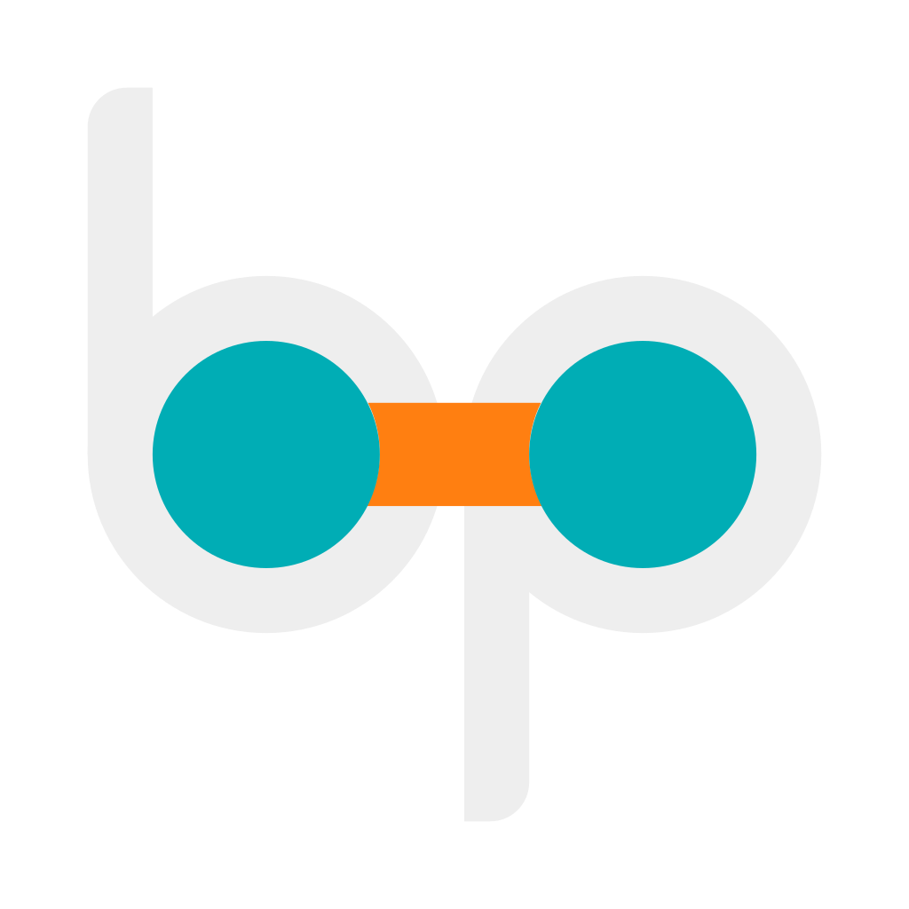

---
hide:
  - navigation
  - toc
---

# Binu Pradeep

I work with companies to conceptualize, design, and create ==**inclusive, effective, and impactful**== digital products. I am passionate about creating products that are not only visually appealing but also user-friendly and accessible.

---
## About Me
{ align=right width="150px" }

- I am a Business Analyst/Project Management professional living in Philadelphia, PA, with over a decade of experience in healthcare and retail domains.
- I focus on designing applications that align with customer goals by using industry-leading tools and technologies for UI design, data analysis, and visualization.
- My philosophy in work, life, and design is that **minimalism and simplicity** are the best tools to communicate your ideas to others.

---

## Tools and Technologies

These are the tools and technologies I work with:

- :simple-postgresql: __SQL__ for database management
- :simple-python: __Python__ for data analysis
- :fontawesome-brands-figma:: __Figma__ for UI design
- :simple-tableau: __Tableau__ for data visualization
- :material-microsoft: __Power BI__ for data analysis
- :simple-adobecreativecloud: __Adobe Creative Cloud__ for graphic design
- :fontawesome-brands-github: __GitHub__ for version control
- :fontawesome-brands-docker: __Docker__ for containerization
- :simple-proxmox: __Proxmox__ for virtualization

---

## Testimonials

> "Binu's excellence at his job can be described in two ways: tenacity and passion. Few people commit so deeply to their work as Binu."  
> **– Koshy, Arun**

> "I worked with Binu on many projects. Binu has outstanding knowledge in Business Analysis methodologies and a great eye for design."  
> **– Singh, Inderjot**

> "Binu is an extremely talented designer of process. He always delivers superior results and is a great person to be around."  
> **– Thomas, Elson**

---

## Contact Me

You can find me on:

- :fontawesome-brands-linkedin: [LinkedIn](https://www.linkedin.com/in/binupradeep/)
- :fontawesome-brands-github: [GitHub](https://www.github.com/binuengoor)
- :material-email-edit: [Email](mailto:mailto:contact@binupradeep.com)

---
{ width="60px" }