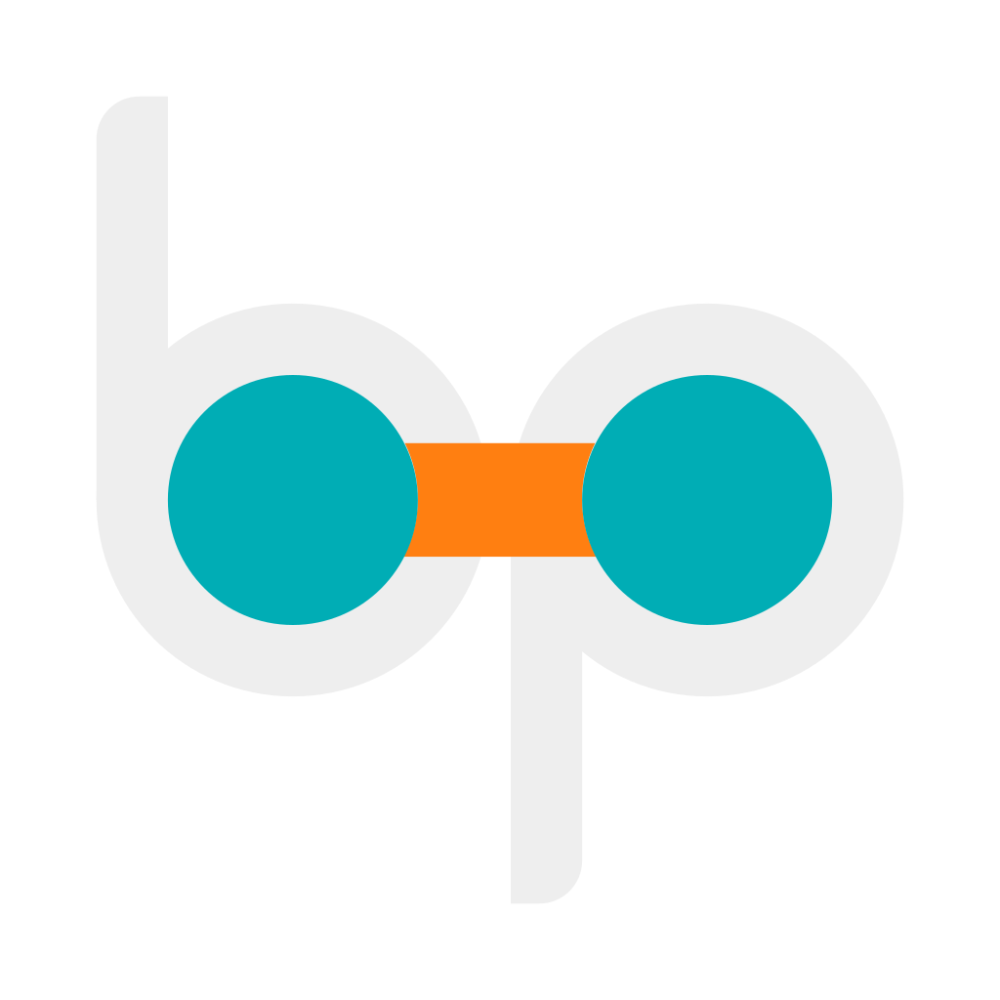

---
hide:
  - navigation
  - toc
---

# Binu Pradeep

I work with companies to conceptualize, design, and create ==**inclusive, effective, and impactful**== digital products. I am passionate about creating products that are not only visually appealing but also user-friendly and accessible.

---
## About Me
{ align=right width="150px" class="profile-avatar" }

- I am a Business Analyst/Project Management professional living in Philadelphia, PA, with over a decade of experience in healthcare and retail domains.
- I focus on designing applications that align with customer goals by using industry-leading tools and technologies for UI design, data analysis, and visualization.
- My philosophy in work, life, and design is that **minimalism and simplicity** are the best tools to communicate your ideas to others.
- Interested in data/system analysis, docker, networking, automations, AI, computing and technology in general.
- Personal interests include singing, music, hiking, and homelab/selfhosting, watching(and playing-xbox) football(soccer).

---

## Featured Projects

-   :material-waveform: __[Audio Analysis Studio](myapps/audio-analysis-studio.md)__
    ---
    Distributed multi-engine audio intelligence stack for BPM tracking, Camelot keys, chords, and LUFS mastering inspection.

-   :material-timer-outline: __[Interval Timer App](myapps/interval-timer-app.md)__
    ---
    Modern interval timer tailored for physical therapy, mobility routines, Edge-TTS audio prompts, voice recognition, and PiP mode.

-   :material-image-size-select-actual: __[Image Optimizer for Web](myapps/image-optimizer-for-web.md)__
    ---
    High-efficiency batch WebP converter with drag-and-drop compression presets and real-time size reduction metrics.

---

## Tools & Technologies

### Product Design, Data & Analytics

- :simple-postgresql: __SQL__ for database management
- :simple-python: __Python__ for data analysis & scripting
- :fontawesome-brands-figma: __Figma__ for UI/UX product design
- :material-chart-scatter-plot: __Tableau__ for data visualization
- :material-microsoft: __Power BI__ for business intelligence
- :material-palette: __Adobe Creative Cloud__ for graphic design

### Systems, Containers & Homelab

- :fontawesome-brands-github: __GitHub__ for version control & CI/CD
- :fontawesome-brands-docker: __Docker__ for containerized deployments
- :simple-proxmox: __Proxmox VE__ for virtualization & hypervisors
- :material-lan: __OpenWrt & VLANs__ for network segmentation

### AI & Autonomous Agents

- :simple-googlegemini: __Google Antigravity__ for autonomous multi-agent development
- :material-robot: __OpenClaw__ for AI agent orchestration & workflows
- :material-feather: __Hermes Agent__ for intelligent reasoning & task execution

---

## Explore the Knowledge Base

-   :material-apps: __[Projects](myapps/audio-analysis-studio.md)__ — Self-developed web apps & containerized tools
-   :material-lan: __[Home Networking](networking/openwrt_vlan.md)__ — OpenWrt VLANs, Samba/NFS, and secure storage
-   :material-code-braces: __[Tech Reference](reference/Shell/fish-shell.md)__ — High-density cheat sheets for Linux, Git, ZFS, and Fish shell
-   :material-compass: __[Blog & Northstar](blog/index.md)__ — Personal essays, mindset reflections, and travelogues

---

## Testimonials

> "Binu's excellence at his job can be described in two ways: tenacity and passion. Few people commit so deeply to their work as Binu."  
> **– Koshy, Arun**

> "I worked with Binu on many projects. Binu has outstanding knowledge in Business Analysis methodologies and a great eye for design."  
> **– Singh, Inderjot**

> "Binu is an extremely talented designer of process. He always delivers superior results and is a great person to be around."  
> **– Thomas, Elson**

---

## Contact Me

You can find me on:

- :fontawesome-brands-linkedin: [LinkedIn](https://www.linkedin.com/in/binuepradeep/)
- :fontawesome-brands-github: [GitHub](https://www.github.com/binuengoor)
- :material-email-edit: [Email](mailto:contact@binupradeep.com)

---
{ width="60px" }