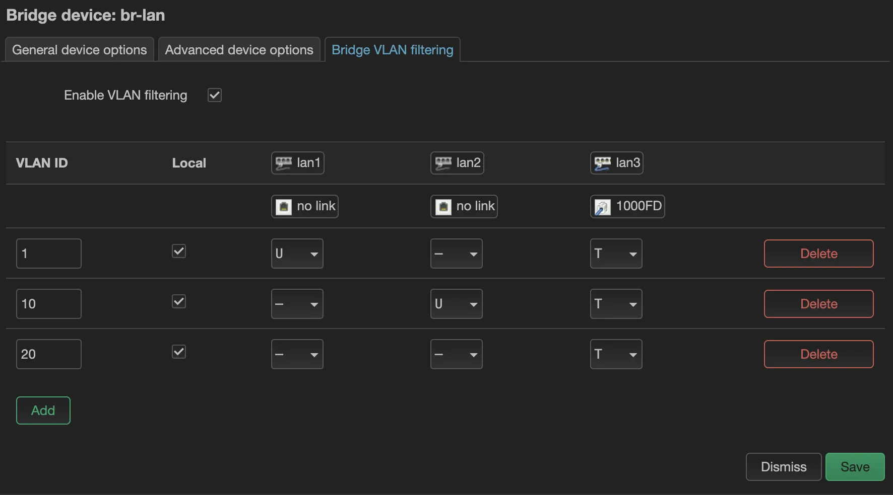
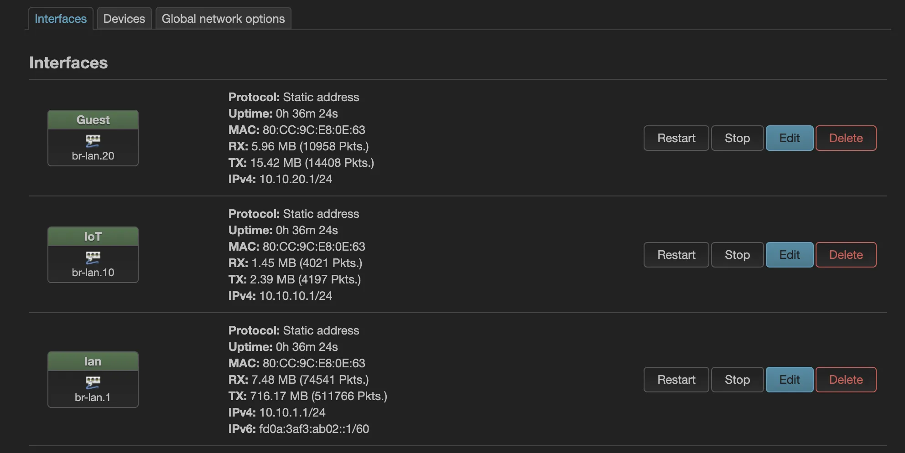
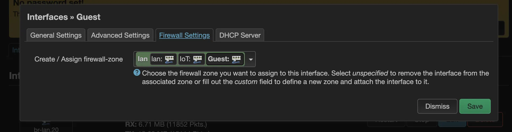
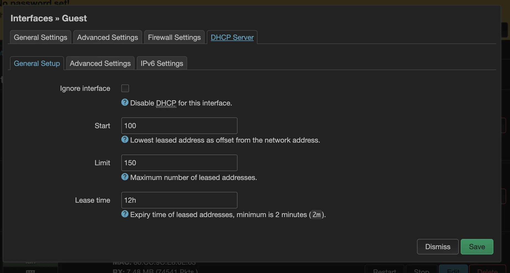
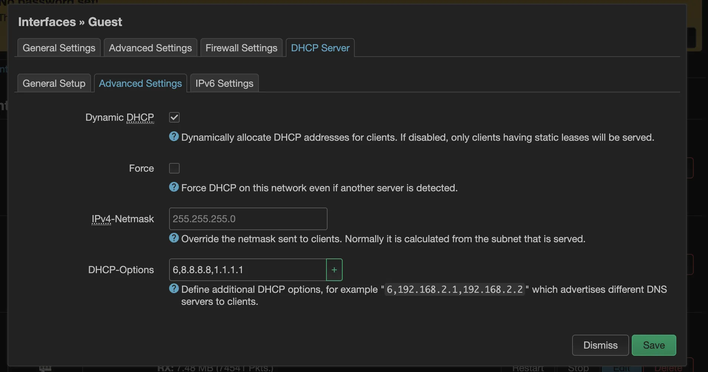
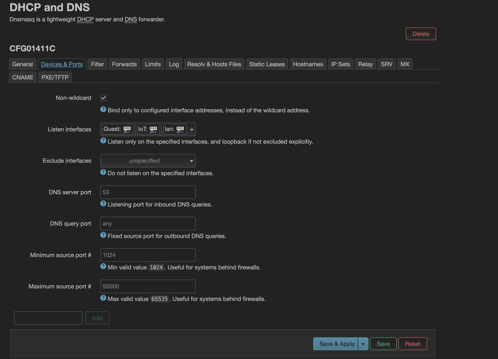
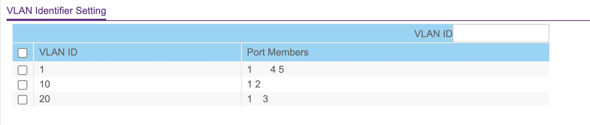

# OpenWrt VLAN Configuration Guide

For illustration purposes, this guide uses 192.168.1.0/24 as the main network. Replace IP addresses according to your needs.

I want to add two more VLANs:

- VLAN 10 - for IoT
- VLAN 20 - for Guest
- Main LAN will become VLAN 1

Requirements:

- All VLANs should use AdguardHome at 192.168.1.1 for DNS
- Only devices in VLAN 1 should be able to access LUCI

## Configuring VLAN Bridge

Navigate to Network → Interfaces → Devices tab

Update br-lan by adding necessary ethernet ports in the General tab.

In the Bridge tab:

Bridge VLAN Configuration

It's good practice to have VLAN 1 untagged in a second port (in this case lan1). This provides a failsafe - if something goes wrong, connecting a cable to lan1 should work as before.

Save changes but **do not Apply** yet!

Go to interfaces tab. 

Set up interfaces as needed. Place them in the "lan" firewall zone for now.

Add DHCP server:

Consider defining public DNS on the new VLAN 10 and 20 based interfaces temporarily:

Note the interface assignments:

- lan interface: br.lan.1
- IoT interface: br.lan.10
- Guest interface: br.lan.20

Navigate to Network → DHCP and DNS → Devices and Ports tab

Add all non-wan interfaces to "Listen Interfaces" for DHCP:

You can now technically click Apply changes, but wait until switch configuration is complete.

The router now has lan3 port tagged for all 3 VLANs. 

Configure the VLAN-aware switch similarly to receive tagged VLAN traffic. Additional ports can be untagged on specific VLANs as needed.

Example configuration:

- Port 1: Tagged for VLANs 1, 10, and 20
- Ports 4, 5: Untagged for VLAN 1
- Port 2: Untagged for VLAN 10
- Port 3: Untagged for VLAN 20

Save changes and return to OpenWrt to apply changes.

## Connect Everything

Plug into port 4 or 5 on the switch for untagged VLAN traffic and access LUCI within 90 seconds. Successfully accessing LUCI will save the changes; otherwise, it reverts to prevent lockout.

DHCP should now work for all VLANs.

Next steps:

1. Configure APs to receive tagged VLANs
2. Set specific SSIDs to specific VLANs
3. Configure firewall rules:
   - VLAN 1: Full access
   - VLAN 10 and 20: Restricted access

Key point: Configure one ethernet port tagged for all VLANs; others can remain untagged on main VLAN.