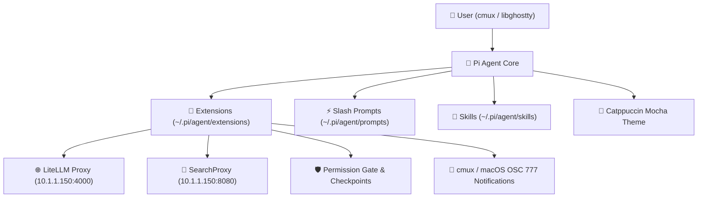

# Pi Agent Guide

A comprehensive guide to configuring and using **Pi** (`@earendil-works/pi-coding-agent`), an extensible, terminal-based AI assistant tailored for macOS, **cmux** (libghostty), and local **LiteLLM** models.

---

## 🌟 Overview & Architecture

Unlike monolithic coding assistants, **Pi** is built on a modular, hackable architecture:
- **Minimalist Core**: Ships with core file inspection, editing, and execution tools (`read`, `edit`, `write`, `bash`).
- **High Extensibility**: Extends dynamically through TypeScript modules, universal Agent Skills (`SKILL.md`), prompt templates, and custom TUI themes.
- **Provider Agnostic**: Seamlessly interfaces with local OpenAI-compatible proxies (**LiteLLM**) and public cloud providers without vendor lock-in.
- **cmux Integration**: Runs inside **cmux** (libghostty), inheriting native macOS background blur, 90% opacity, and Catppuccin Mocha aesthetic harmony.



---

## 🎨 Aesthetic & TUI Configuration

Pi has been styled with a custom **Catppuccin Mocha** palette (`~/.pi/agent/themes/catppuccin-mocha.json`), aligning with cmux, Ghostty, Starship, and Fish syntax coloring.

### Settings Configuration (`~/.pi/agent/settings.json`)

```json
{
  "theme": "catppuccin-mocha",
  "defaultProvider": "litellm",
  "defaultModel": "smart",
  "defaultThinkingLevel": "medium",
  "externalEditor": "nano",
  "defaultProjectTrust": "ask",
  "compaction": {
    "enabled": true,
    "reserveTokens": 16384,
    "keepRecentTokens": 20000
  },
  "retry": {
    "enabled": true,
    "maxRetries": 3,
    "baseDelayMs": 2000
  },
  "markdown": {
    "codeBlockIndent": "  ",
    "mermaid": "streaming"
  },
  "terminal": {
    "showImages": true,
    "imageWidthCells": 60
  },
  "enabledModels": [
    "litellm/smart",
    "litellm/fast",
    "litellm/code",
    "litellm/openrouter-free",
    "litellm/kilo-free",
    "litellm/free"
  ]
}
```

### Why These Settings Matter for Non-Coders:
1. **`defaultModel: "smart"`**: Small coding models give terse, cryptic code snippets assuming expert software engineering background. The `smart` model (Gemini 3.6 Flash reasoning) provides a massive **1,000,000 token context window** and patient, plain-English explanations.
2. **`externalEditor: "nano"`**: Pressing <kbd>Ctrl</kbd> + <kbd>G</kbd> inside Pi opens the friendly `nano` editor with an on-screen shortcut guide, completely eliminating Vi modal traps.
3. **`compaction.enabled = true`**: Automatically summarizes older context as conversations grow so Pi never crashes or runs out of token memory.
4. **`mermaid: "streaming"`**: Renders architectural flowcharts and sequence diagrams directly in your terminal.

---

## ⚡ Instant Slash Commands (`/prompts`)

Type `/` followed by the template name in the Pi editor for instant workflows:

| Slash Command | Template | Description & Purpose |
| :--- | :--- | :--- |
| **`/explain`** | `explain.md` | Explains files, functions, or concepts in plain English using simple real-world analogies. |
| **`/fix`** | `fix.md` | Diagnoses errors, explains the root cause simply, and applies a safe, verified fix. |
| **`/plan`** | `plan.md` | Formulates a structured milestone plan and **waits for confirmation** before touching files. |
| **`/review`** | `review.md` | Inspects recent changes (`git diff`) and summarizes quality and safety in bullet points. |
| **`/doc`** | `doc.md` | Generates structured Markdown documentation or Obsidian notes. |
| **`/commit`** | `commit.md` | Analyzes changes and drafts conventional Git commit messages. |
| **`/copy`** | `clipboard.ts` | Copies the last agent response or code block directly to the macOS clipboard. |
| **`/litellm`** | `litellm-autodiscover.ts` | Discovers and refreshes all active models from your LiteLLM server on the fly. |
| **`/searchproxy`** | `searchproxy.ts` | Checks SearchProxy latency, connection status, and active endpoint. |

---

## 🧩 Installed Extensions (`~/.pi/agent/extensions/`)

Pi extensions hook directly into agent lifecycle events:

### 1. LiteLLM Dynamic Autodiscovery (`litellm-autodiscover.ts`)
- **Probes LAN Endpoints**: Automatically queries `http://10.1.1.150:4000/v1/models` on startup.
- **Smart Filtering**: Automatically filters out embedding and audio models to keep the model picker clean.
- **Self-Healing Cache**: Writes discovered models to `~/.pi/agent/models.json` so you can use Pi offline or away from home with 0ms lag.
- **Interactive Command**: Type `/litellm` or `/sync-models` to refresh available models anytime.

### 2. SearchProxy Web Intelligence (`searchproxy.ts`)
Equips Pi with live web search and deep research tools:
- `web_search`: Searches, reranks with BGE, scrapes full pages, and synthesizes cited answers.
- `web_fetch`: Extracts clean Markdown from any specific URL using Crawl4AI and Jina.
- `search_snippets`: Rapid search for URLs and snippets.
- `deep_research`: Multi-hop deep research that decomposes complex queries into sub-questions.

### 3. Destructive Command Gate (`permission-gate.ts`)
- **Safety First**: Intercepts dangerous bash commands (`rm -rf`, `sudo`, `dd`, `chmod 777`, `git reset --hard`).
- **Interactive Confirmation**: Prompts you before execution:
  ```text
  ⚠️ Potentially Destructive Command Detected:
    rm -rf /path/to/directory
  Do you want to allow this command to run?
  [Allow command]  [Block command]
  ```

### 4. Native cmux & macOS Notifications (`notify.ts`)
- Emits terminal escape code `OSC 777` when long reasoning or research queries complete.
- Sends an instant macOS banner notification:
  > **Pi Agent**: *Task finished • Ready for input*

### 5. Git Checkpoint Undo Machine (`git-checkpoint.ts`)
- Creates an automatic Git stash checkpoint before each turn.
- Offers an instant **"Restore code state?"** prompt if an experimental edit didn't work out.

### 6. macOS Clipboard Integration (`clipboard.ts`)
- Provides AI tools `copy_to_clipboard` and `read_clipboard`.
- Adds the `/copy` slash command to grab responses without manual mouse selection.

### 7. Non-Coder Persona (`non-coder-persona.ts`)
- Enforces plain-English explanations without condescending tech jargon.
- Requires command transparency before executing scripts.
- Prioritizes macOS `trash` over permanent `rm` file deletion.

---

## 🎯 Turnkey Skills (`~/.pi/agent/skills/`)

Skills follow the universal **Agent Skills standard** (`SKILL.md`):

### `git-assistant`
Automates Git workflows safely:
- Inspects working trees (`git status -sb`).
- Validates diffs to protect private keys and `.env` files.
- Generates conventional commits (`feat:`, `fix:`, `docs:`).
- Pushes to GitHub cleanly with status confirmation.

### `obsidian-notes`
Formats explanations, meeting notes, and web research into elegant Markdown files ready for Obsidian, MkDocs, or Notion:
- Structured YAML frontmatter (`title`, `date`, `tags`, `summary`).
- Obsidian/GitHub callout boxes (`> [!NOTE]`, `> [!TIP]`, `> [!WARNING]`).
- Mermaid diagrams and concise bullet points.

---

## ⌨️ Essential Pi Keyboard Shortcuts

| Shortcut | Action | Description |
| :--- | :--- | :--- |
| <kbd>Ctrl</kbd> + <kbd>P</kbd> | **Model Switcher** | Cycle through enabled models (`smart`, `code`, `fast`, `free`). |
| <kbd>Ctrl</kbd> + <kbd>G</kbd> | **External Editor** | Edit current prompt buffer in `nano` with on-screen shortcuts. |
| <kbd>Ctrl</kbd> + <kbd>C</kbd> | **Cancel / Interrupt** | Stop agent generation or tool execution safely. |
| <kbd>Ctrl</kbd> + <kbd>L</kbd> | **Clear Screen** | Clears terminal screen while keeping conversation in memory. |
| <kbd>Tab</kbd> | **Autocomplete** | Accept autosuggestion or cycle through slash commands (`/`). |
| <kbd>Esc</kbd> <kbd>Esc</kbd> | **Session Tree** | View conversation branches and navigate session history. |
| `/` | **Command Palette** | Open autocomplete menu for prompt templates and extensions. |

---

## 🚀 Quick Start Cheat Sheet

```bash
# Launch Pi interactively (starts in Catppuccin Mocha with 'smart' model)
pi

# Run a quick one-off query without entering interactive mode
pi -p "Explain how DNS resolution works in 3 bullet points"

# Resume your last conversation session
pi -c

# Interactively browse and resume past sessions
pi -r

# Refresh models from LiteLLM proxy
/litellm

# Copy the last answer to macOS clipboard
/copy
```
