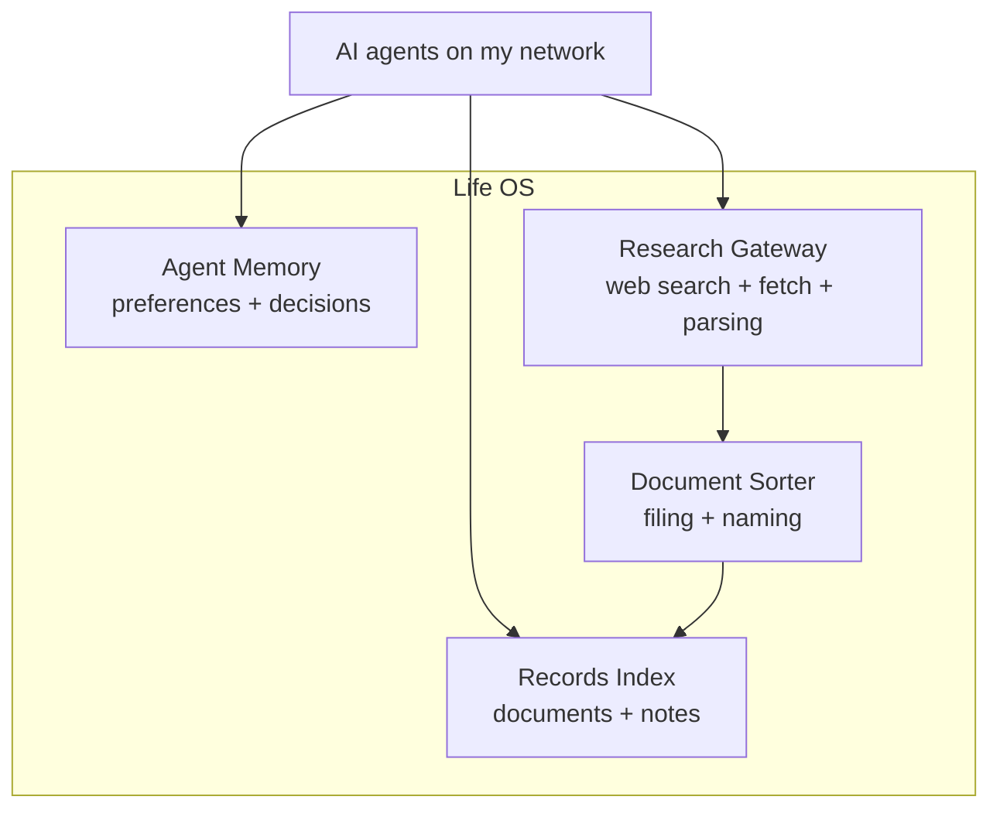

**Life OS** is a suite of self-hosted services that work together as one system: a private memory and filing layer for my family's records and notes, built to be used by AI agents. Ask any agent I run a question about my life and it finds the right page, checks the date, and answers with the source.

Why "operating system"? Like one, it is a small kernel plus services that share common interfaces, and applications (here, AI agents) don't need to know how any of it works underneath. They just make calls.

This is a showcase, not a how-to. The system holds personal data, so there is no code, install guide or screenshot here on purpose.

## The Idea

Most "chat with your documents" projects put the language model inside the application. I did the opposite. **Life OS finds and fetches; the agent thinks.**

- Life OS owns the boring, reliable parts: indexing, search, filing, memory, access control and a small set of lookup tools.
- The calling agent owns the reasoning: which page to open next, whether two sources disagree, whether a date has expired.
- Every time agent models improve, answers improve, and Life OS does not change.

## The Four Components

### Records Index

The core. A document archive and a notes vault are checked on a schedule and merged into one searchable index.

- **Hybrid search**: keyword and vector search, combined and re-ranked, with filters for person, area and date.
- **Agent-friendly tools**: a handful of verbs (research, find, read, browse, look up an entity, view history) exposed over the Model Context Protocol, so a new agent connects with no custom glue.
- **Answers with receipts**: every result carries its source and date, and "newest wins" rules help an agent pick the current document over a stale one.
- **Corrections that stick**: a wrong fact or missing nickname is recorded as a journaled change that can be reviewed and undone.
- **Measured accuracy**: a golden set of 30 real questions is replayed against a Claude agent using only these tools. The latest run answered 29 of 30 correctly.

### Agent Memory

Records answer *what my documents say*. Memory answers *how I work and what I decided*. It is one shared long-term memory for every agent, stored as plain Markdown and served over MCP and REST.

- **Just-in-time context**: a lightweight router injects only the few facts relevant to the current turn.
- **Post-turn harvesting**: a small model extracts durable facts (decisions, constraints, state changes) and ignores chatter.
- **Contradiction handling**: when a new fact replaces an old one, the old one is marked superseded instead of piling up.
- **Sleep-time consolidation**: a quiet-hours pass merges duplicates and prunes noise, with pinned items preserved and a quality gate on changes.
- **Skill promotion**: procedures that keep working are promoted into reusable skills other agents can discover.
- **Portable and safe**: plain files written atomically, so I can switch tools or models without a migration and a crash never leaves half a memory.

### Research Gateway

What started as a search-provider rotator became the network's retrieval service for the web and for documents.

- **Search with failover**: several providers behind one endpoint, so one quota or outage never breaks a workflow.
- **One-shot and deep research**: fast cited answers, or a multi-step plan that decomposes a question, searches in parallel, re-ranks and writes a cited report.
- **Evidence mode**: passages within a token budget, each with its URL, for agents that want to reason themselves.
- **Resilient fetching**: a tiered chain from a plain fetch up to browser rendering and anti-bot fallbacks, returning clean Markdown.
- **Document parsing**: PDFs and office files are extracted, with OCR as a fallback when text extraction is incomplete.
- **Monitors and background jobs** for watching pages and running long crawls, plus compatibility bridges so tools written for other popular search APIs work unchanged.

### Document Sorter

An automated filing clerk for the secured archive. I drop a scan or download into an inbox, and minutes later it is renamed consistently and filed in the right place.

- **A Markdown rulebook** that I can read and the code can parse. If it is malformed, the sorter pauses and names the broken line instead of guessing.
- **Human in the loop**: low-confidence items wait in a review queue with the model's best guess, and nothing is deleted automatically.
- **Learns from corrections**: moving a file to the right place becomes a learned rule.
- **Projects**: a time-boxed effort gets its own folder, and related documents are routed into it while it is open.
- **Logged and reported**: a history of every action and a monthly summary of what was filed, reviewed and stale.
- **Boring technology**: one Python program using only the standard library, with tests.

Consistent names and locations from the sorter are what keep the Records Index accurate.

## Design Principles

- **Read-only toward the sources.** The index never writes to the archive and never deletes or renames a note.
- **Per-person access.** Each family member's records are only visible to requests made on their behalf.
- **Text is data, never instructions.** A sentence inside a document cannot make a service call a tool, open a URL or write a file.
- **Private network only.** Nothing here is published to the internet.
- **Small on purpose.** A hard line budget on the core code and a rule against heavy frameworks keep it boring and obviously correct.
- **Zero-retention models.** The few places a model touches my data (embeddings, OCR, classification) go through aliases that do not keep it.

## Why It Matters for Local Agents

I run a lot of agents: coding assistants, chat front-ends, scheduled helpers. Each used to answer "where is that document?" with a shrug and forget every decision by the next session. Now they all share one source of truth for records, one memory of how I work, and one gateway to the outside world.

- **Continuity**: a new agent starts with what the last one learned.
- **Consistency**: one answer, with a source, regardless of which tool asks.
- **Lower cost**: small, targeted context beats re-sending a long history.
- **Control**: everything runs in containers on my own hardware.
