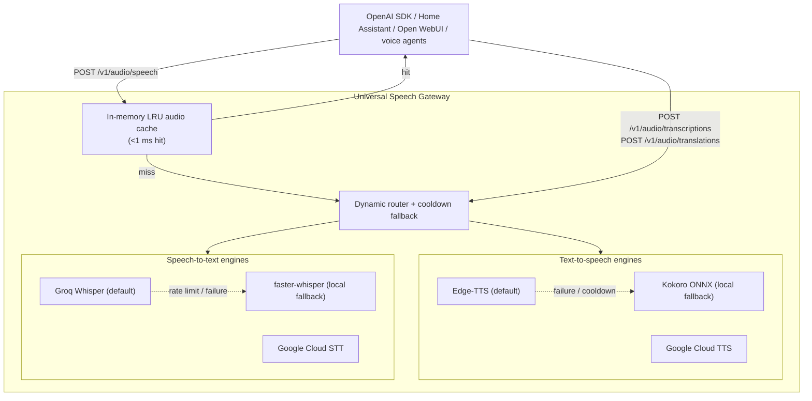

import { Tabs, TabItem } from '@astrojs/starlight/components';

**Universal Speech Gateway** (formerly Universal TTS Gateway) is a production-grade, multi-architecture speech gateway that serves as a **1:1 drop-in replacement** for OpenAI's audio endpoints: `POST /v1/audio/speech`, `POST /v1/audio/transcriptions`, `POST /v1/audio/translations`, `GET /v1/models` and `GET /v1/audio/voices`. Built on Python and FastAPI, it puts cloud neural voices, offline ONNX voices and Whisper-based transcription behind one local endpoint, with automatic cloud-to-local fallback, in-memory caching and zero-transcode streaming.

- **GitHub Repository**: [Universal-Speech](https://github.com/binuengoor/universal-speech)
- **Docker Image**: [`ghcr.io/binuengoor/universal-speech:latest`](https://github.com/binuengoor/universal-speech/pkgs/container/universal-speech)

:::note[Renamed]
This project started as the Universal TTS Gateway. It grew speech-to-text, so it is now the Universal Speech Gateway. The old `/myapps/universal-tts/` address redirects here.
:::

---

## Overview

AI assistants, local LLM front-ends and smart-home platforms (Home Assistant, Open WebUI, custom voice agents) mostly target OpenAI's audio APIs. Relying only on a commercial cloud brings recurring cost, vendor lock-in and fragility when the internet drops.

The gateway orchestrates several speech backends under standard OpenAI semantics. Clients talk to one local endpoint. For **speech out**, they pick between fast free cloud neural voices (Edge-TTS), studio-quality local voices (Kokoro) and Google Cloud voices. For **speech in**, requests go to Groq's hosted Whisper for speed, with a local faster-whisper runtime as the offline fallback. A cooldown-based circuit breaker keeps both directions working through outages, and an LRU cache answers repeated phrases in under a millisecond.

---

## Key Features

### 1. 1:1 OpenAI API Compatibility
- **Drop-in endpoints**: works with the official OpenAI SDKs, Home Assistant, Open WebUI and any client that targets `/v1/audio/*`.
- **Discovery**: models via `GET /v1/models` and a cross-engine voice catalog via `GET /v1/audio/voices`.
- **Voice aliases**: OpenAI voice names (`alloy`, `echo`, `fable`, `onyx`, `nova`, `shimmer`) map to natural neural voices without touching client configs.

### 2. Text-to-Speech Engines
- ☁️ **Microsoft Edge-TTS (default)**: free cloud neural voices such as `en-US-AriaNeural`, about 200–300 ms with no local CPU load.
- 🟣 **Kokoro-TTS (local studio)**: an 82M-parameter ONNX model (`af_heart`) with warm, expressive prosody. It is also the offline fallback.
- ☁️ **Google Cloud TTS (optional)**: Neural2 and Journey voices through a service account.
- 🔵 **Piper-TTS (optional)**: a lightweight offline ONNX engine, available but disabled by default.

### 3. Speech-to-Text Engines
- ⚡ **Groq Cloud (default)**: `whisper-large-v3-turbo` and `whisper-large-v3`, roughly 150–250 ms latency.
- 💻 **faster-whisper (local fallback)**: CTranslate2 INT8 on CPU (`base`, `small`). It runs on x86-64 and ARM64 without a GPU or PyTorch.
- ☁️ **Google Cloud Speech-to-Text (optional)**: a further fallback that reuses the same service account.
- 🌍 **Translations**: `POST /v1/audio/translations` returns English text from foreign-language audio.

### 4. Zero-Transcode Passthrough
- Incoming audio (MP3, WAV, M4A, OGG, WebM) is forwarded to Groq without server-side transcoding.
- Native MP3 passthrough for Edge-TTS and native WAV for Kokoro. FFmpeg converts only when a caller asks for another format.

### 5. In-Memory LRU Audio Cache
- SHA-256 keys over text, voice, engine, speed and format.
- Repeated phrases ("The front door is unlocked") return in under 1 ms.
- Defaults of 500 entries or 50 MB with a 24 h TTL.

### 6. Resilient Fallback
- A failing upstream enters a 60-second cooldown and is skipped instantly, so clients see no added wait.
- TTS falls back from Edge-TTS to Kokoro, and STT from Groq to local faster-whisper.

### 7. Multi-Architecture Docker
- Published to GitHub Container Registry for `linux/amd64` and `linux/arm64` (Apple Silicon, ARM cloud instances, Raspberry Pi 5).

---

## Architecture Overview



---

## Voice Matrix & Engine Mappings

| Engine | Default Voice | Fallback Behavior | Native Format | Latency | Purpose |
| :--- | :--- | :--- | :---: | :---: | :--- |
| **Edge-TTS** *(default)* | `en-US-AriaNeural` | Invalid voice → Aria. Network failure → Kokoro `af_heart` | MP3 | ~200–300 ms | Fast, zero CPU load, natural |
| **Kokoro-TTS** *(local)* | `af_heart` | Invalid voice → `af_heart` | WAV | ~1.5–2 s | Offline, expressive prosody |
| **Google Cloud** | `en-US-Neural2-F` | Network failure → Kokoro | MP3 | ~250–350 ms | Neural2 and Journey voices |

### OpenAI Voice Alias Mapping

| OpenAI Voice | Mapped Gateway Voice | Engine |
| :--- | :--- | :--- |
| `alloy` | `en-US-AriaNeural` | Edge-TTS |
| `echo` | `en-US-GuyNeural` | Edge-TTS |
| `fable` | `en-GB-SoniaNeural` | Edge-TTS |
| `onyx` | `en-US-ChristopherNeural` | Edge-TTS |
| `nova` | `en-US-JennyNeural` | Edge-TTS |
| `shimmer` | `en-US-AnaNeural` | Edge-TTS |

---

## Installation & Setup

### Option 1: Docker Compose (Recommended)

```yaml
services:
  universal-speech:
    image: ghcr.io/binuengoor/universal-speech:latest
    container_name: universal-speech
    restart: unless-stopped
    ports:
      - "8000:8000"
    environment:
      - GROQ_API_KEY=your-groq-api-key   # optional, enables fast cloud STT
    volumes:
      - ./config.yaml:/app/config.yaml:ro
      - ./models:/app/models
      - ./credentials:/app/credentials:ro
    healthcheck:
      test: ["CMD", "curl", "-f", "http://localhost:8000/health"]
      interval: 30s
      timeout: 5s
      retries: 3
      start_period: 10s
```

```bash
docker compose up -d
```

### Option 2: Local Development with `uv`

```bash
git clone https://github.com/binuengoor/universal-speech.git
cd universal-speech

uv venv
source .venv/bin/activate
uv pip install -e ".[all]"

# Download the offline Kokoro model
python scripts/download_models.py

uvicorn gateway.main:app --host 0.0.0.0 --port 8000
```

---

## Client Integration Examples

### Official OpenAI Python SDK

```python
from openai import OpenAI

client = OpenAI(
    base_url="http://localhost:8000/v1",
    api_key="not-needed",  # or your configured server API key
)

# Text-to-speech
speech = client.audio.speech.create(
    model="edge-tts",  # or 'kokoro', 'tts-1'
    voice="alloy",     # maps to en-US-AriaNeural
    input="Universal Speech Gateway is ready for production!",
)
speech.stream_to_file("output.mp3")

# Speech-to-text
with open("speech.mp3", "rb") as audio_file:
    transcript = client.audio.transcriptions.create(
        model="whisper-1",  # Groq first, local faster-whisper as fallback
        file=audio_file,
    )
print(transcript.text)
```

### cURL

<Tabs>
<TabItem label="Text-to-speech">

```bash
curl http://localhost:8000/v1/audio/speech \
  -H "Content-Type: application/json" \
  -d '{"model": "edge-tts", "voice": "en-US-AriaNeural", "input": "Hello from the gateway!"}' \
  --output speech.mp3
```

</TabItem>
<TabItem label="Transcription">

```bash
curl http://localhost:8000/v1/audio/transcriptions \
  -F "file=@speech.mp3" \
  -F "model=whisper-1"
```

</TabItem>
<TabItem label="Translation to English">

```bash
curl http://localhost:8000/v1/audio/translations \
  -F "file=@foreign_audio.wav" \
  -F "model=whisper-1"
```

</TabItem>
</Tabs>

### Discovery Endpoints

```bash
curl http://localhost:8000/v1/models
curl http://localhost:8000/v1/audio/voices
curl http://localhost:8000/health
```

### Home Assistant

Configure the OpenAI TTS integration with the gateway endpoint:

- **Base URL**: `http://<gateway-ip>:8000/v1`
- **API Key**: any dummy string
- **Voice**: `alloy` or `en-US-AriaNeural`
- **Model**: `edge-tts` or `kokoro`

---

## Configuration Reference (`config.yaml`)

```yaml
server:
  host: "0.0.0.0"
  port: 8000
  api_key: ""                      # Optional Bearer token authentication
  cors_origins: ["*"]

defaults:
  engine: "edge-tts"
  voice: "en-US-AriaNeural"
  speed: 1.0
  response_format: "mp3"

cache:
  enabled: true
  max_entries: 500
  max_memory_mb: 50
  ttl_seconds: 86400

circuit_breaker:
  enabled: true
  timeout_seconds: 5.0
  fallback_engine: "kokoro"
  fallback_voice: "af_heart"
  cooldown_seconds: 60.0

stt:
  enabled: true
  default_engine: "groq"
  default_model: "whisper-1"
  fallback_engine: "local-whisper"
  cooldown_seconds: 60.0
  engines:
    groq:
      enabled: true
      api_key: ""                  # Or set GROQ_API_KEY
      default_model: "whisper-large-v3-turbo"
      timeout_seconds: 10.0
    local_whisper:
      enabled: true
      model_size: "base"           # tiny, base, small
      device: "cpu"
      compute_type: "int8"
      cpu_threads: 4
    google_cloud:
      enabled: true
      credentials_path: "credentials/google-service-account.json"
      language_code: "en-US"

engines:
  edge_tts:
    enabled: true
    default_voice: "en-US-AriaNeural"
    native_format: "mp3"
  kokoro:
    enabled: true
    default_voice: "af_heart"
    native_format: "wav"
  piper:
    enabled: false
    default_voice: "en_US-ryan-medium"
    native_format: "wav"
  google_cloud:
    enabled: true
    default_voice: "en-US-Neural2-F"
    native_format: "mp3"
```

---

## Latency & Performance Benchmarks

Measured on Apple Silicon:

| Engine | Voice | Cache State | Latency | Audio Size | Real-Time Factor |
| :--- | :--- | :---: | :---: | :---: | :---: |
| **Edge-TTS** | `en-US-AriaNeural` | **HIT** | **&lt; 1 ms** | 45.8 KB | 0.00 |
| **Edge-TTS** | `en-US-AriaNeural` | MISS | 285 ms | 45.8 KB | 0.00 |
| **Piper-TTS** | `en_US-ryan-medium` | MISS | 247 ms | 265.0 KB | 0.04 |
| **Kokoro-TTS** | `af_heart` | MISS | 2,036 ms | 353.0 KB | 0.27 |

The repository ships 35+ unit and integration tests covering TTS, STT, caching and fallback.

---

## License

Distributed under the MIT License. See [LICENSE](https://github.com/binuengoor/universal-speech/blob/main/LICENSE) for details.
